# Исходные данные

В качестве исходных данных будут использованы слои пространственных данных:

-   расположение школ Санкт-Петербурга - *Школы.geojson*;

-   границы муниципальных образований Калининского района - *Муниципальные образования.geojson;*

-   жилые многокватирные дома в Калининском районе - *Жилые дома.geojson.*

Все файлы вы можете скачать по ссылке или QR-коду, приведенному ниже.

Для того, чтобы открыть файлы в программе QGIS достаточно просто перетащить их в рабочее пространство окна мышкой.

# Практический кейс 1

## Условия задачи

Рассчитать какое количество школ находится в зоне доступности у каждого из жилых зданий.

В качестве зоны доступности необходимо использовать радиус - 500 м[^1].

[^1]: СП 42.13330.2016 Градостроительство. Планировка и застройка городских и сельских поселений

## Порядок решения задачи

### Построение зоны доступности

В первую очередь необходимо построить зоны доступности вокруг школ.

Сделать мы это можем, построив буферные зоны. **Буферная зона - это область на карте, каждая точка внутри которой находится в пределах заданного расстояния от исходного объекта.**

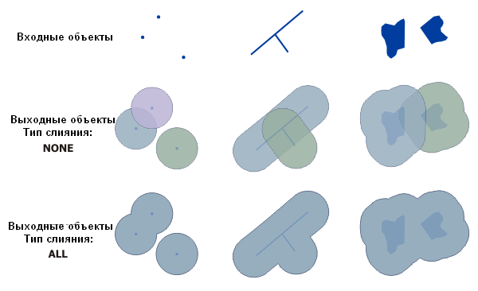{fig-align="center"}

::: callout-important
Для построения буферных зон и последующих операций нам необходима *Панель инструментов анализа*. Открыть ее можно, нажав на кнопку 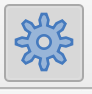{width="56"} на основной панели инструментов, или с помощью строки меню *Вид* $\longrightarrow$ *Панели* $\longrightarrow$ *Инструменты анализа*.

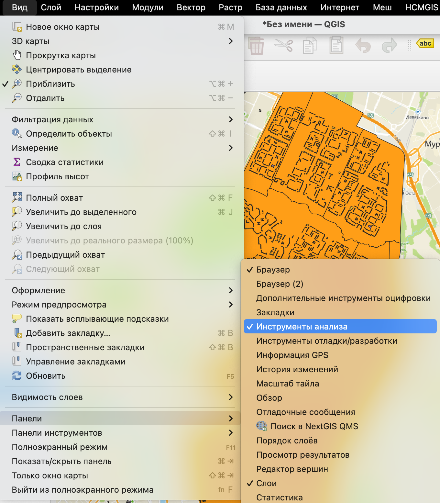{fig-align="center" width="900"}

Эта панель должна открыться в правой части вашего основного рабочего пространства.

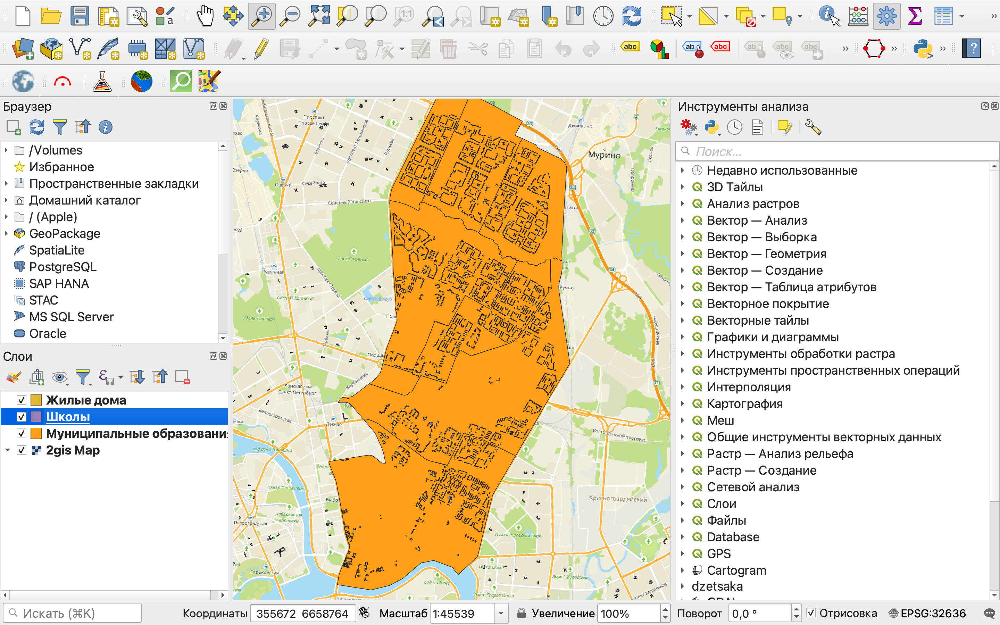{fig-align="center" width="1000"}
:::

Для создания буферных зон есть одноименный инструмент *Буферизация* в панели инструментов анализа.

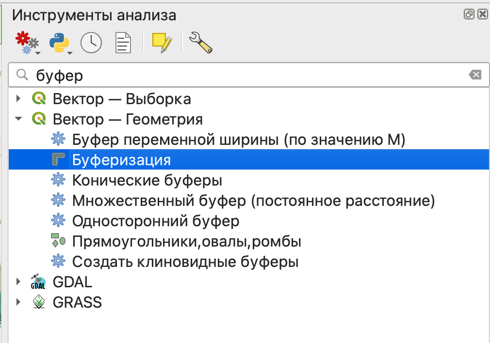{fig-align="center" width="856"}

::: callout-tip
Как видите, у нас есть несколько очень похожих инструментов, мы с вами будем пользоваться самым простым из них.

Что же делают остальные?

-   буфер переменной ширины - размер буферной зоны будет зависеть от величины какого-то показателя;

-   множественный буфер - создание сразу нескольких буферных зон с определенным шагом по расстоянию;

-   конические буферы (на самом деле клиновидные) - буфер для линейного объекта с разными значениями размера в начале и конце линии;

-   односторонний буфер - создание буфера только с одной стороны линейного объекта;

-   создать клиновидные буферы - создание буферов в форме сектора круга от точечных объектов.
:::

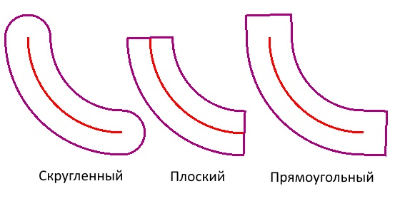{alt="Источник: https://help.axioma-gis.ru/index.html?editing_buffer.html" fig-align="center" width="574"}

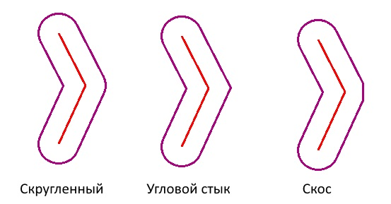{alt="Источник: https://help.axioma-gis.ru/index.html?editing_buffer.html" fig-align="center" width="574"}

В качестве размера буферной зоны мы воспользуемся основным градостроительным нормативом доступности для школ - 500 метров до жилых зданий.

Если вы использовали другие объекты, то вы можете взять другое расстояние.

Например, для детских садов зона доступности - 300 метров, для поликлиник - 1000 метров.

Для объектов коммерческой инфраструктуры нормативов нет, но вы можете взять свое произвольное значение.

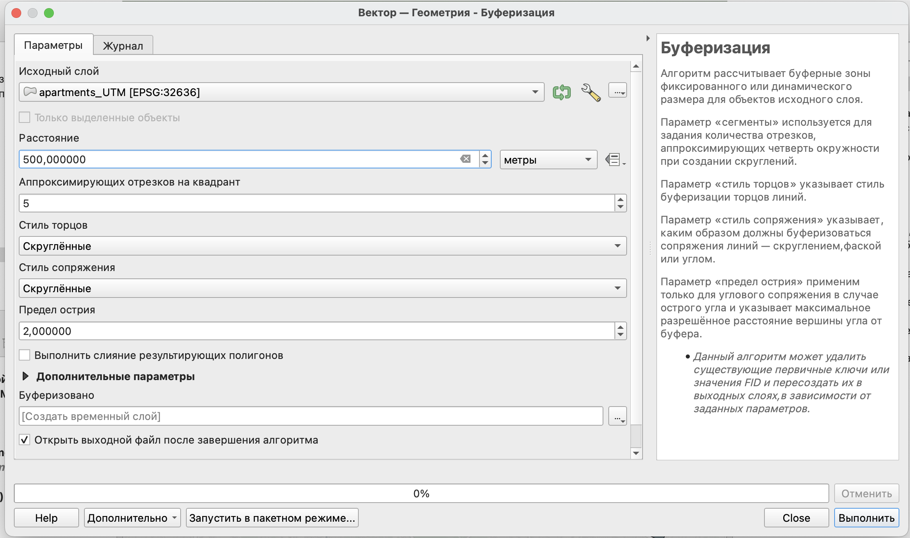{fig-align="center" width="1520"}

Так как в нашем случае буферные зоны строятся для точечных объектов, то основным параметром будет расстояние - размер зоны.

Также роль будет играть параметр *Выполнить слияние результирующих полигонов*: при его выборе все полученные полигоны будут объединены в один объект.

Если вы хотите сразу сохранить свой слой без создания временного файла, то вы можете нажать на кнопку 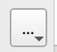{width="55"} и выбрать пункт *Сохранить в файл*, после чего выбрать место для сохранения и указать имя файла.

В итоге вы увидите новый слой в панели слоев и его отображение на карте.

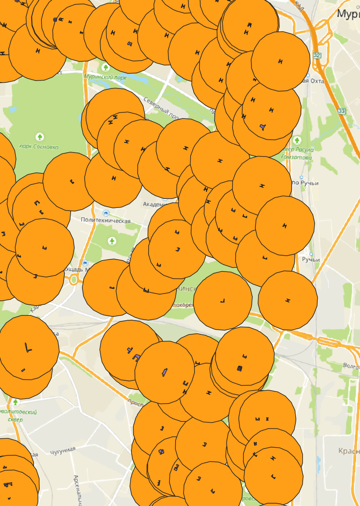

### Определение зданий, попавших в границы буферных зон

Далее мы можем осуществить поиск домов, которые попадают в заданные области обслуживания.

Для поиска объектов есть группа инструментов **Вектор — Выборка**.

Часть инструментов в ней начинается со слова *Выбрать (Выделить)*, а часть - *Извлечь*. Разница между ними в том, что в первом случае объекты просто выделяются в исходном слое, а во втором - объекты, соответствующие заданным условия, извлекаются в новый слой.

Краткое описания инструментов:

-   *выбрать/извлечь по атрибуту* - поиск объектов по значению одного из атрибутов;

-   *выбрать/извлечь по выражению* - поиск объектов по значениям нескольких атрибутов одновременно;

-   *выбрать/извлечь по пространственному отношению* - поиск объектов по их расположению относительно объектов другого слоя;

-   *выделить/извлечь в пределах расстояния* - поиск объектов в пределах заданного расстояния от других объектов;

-   *случайное выделение/случайное извлечение* - случайная выборка объектов из слоя (заданного числа объектов или заданного процента объектов);

-   *случайное выделение в подмножествах/случайное извлечение в подмножествах* - сначала слой разбивается по категориям по одному из атрибутов, потом из каждой категории извлекается заданное число или заданный процент объектов.

Нам нужно определить, какие здания попадают в буферные зоны, поэтому нужно воспользоваться **выбрать\\извлечь по пространственному отношению**.

Для выбора объектов нужно сначала указать в каком слое осуществляется поиск (слой со зданиями), геометрический оператор (как объекты расположены относительно объектов другого слоя) и слой для сравнения (буферные зоны). Геометрические операторы в данном случае лучше выбирать *Пересекает* и *Находится внутри*.

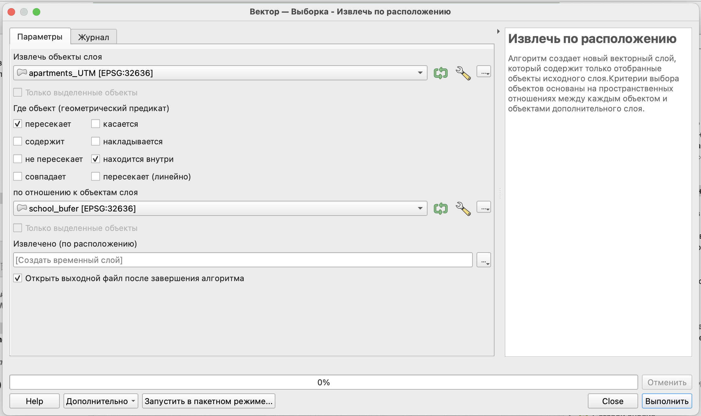{fig-align="center" width="1514"}

По результатам извлечения вы получите новый слой, который будет содержать только здания, удовлетворяющие заданным условиям.

::: callout-tip
Инструмент *Выбрать по расположению* работает аналогично, но результатом у вас будет не просто новый слой, а выделенный набор объектов в текущем слое.
:::

::: callout-tip
Также вы можете попробовать найти здания в пределах заданного расстояния от школ при помощи инструментов *Выделить в пределах расстояния/Извлечение в пределах расстояния*.

Однако следует помнить, что расстояние будет определяться в системе координат проекта, поэтому будет отличаться от того, что получено при помощи буферных зон.
:::

### Расчет количества школ, находящихся в зоне доступности

На последнем этапе решения задачи нам необходимо фактически посчитать, в какое количество буферных зон попало каждое здание.

Для этого воспользуемся функцией пространственного агрегирования, которая позволяет рассчитать определенный статистический показатель в границах объектов.

::: callout-tip
При пространственном агрегировании возможен расчет в пределах одного слоя, но, как правило, расчет показателя осуществляется для объектов одного слоя в сравнении с объектами другого слоя.
:::

# Практический кейс 2

## Условия задачи

Найти в зоне доступности школ объекты:

-   наличие которых было бы плюсом в непосредственной близости от школы;

-   наличие которых нежелательно в вблизи от школы.

::: callout-important
Перечень таких объектов вы можете определить самостоятельно (как лично, так и на основе консультации с учениками), так и воспользоваться нормативной документацией.
:::

Рассчитать количество объектов каждого из типов в зоне доступности школы.

Определить в окрестности каких школ количество нежелательных объектов превышает количество положительных объектов.

## Порядок решения задачи
