# Исходные данные

В качестве исходных данных будут использованы слои пространственных данных:

-   расположение школ Санкт-Петербурга - *Школы.geojson*;

-   границы муниципальных образований Калининского района - *Муниципальные образования.geojson;*

-   жилые многокватирные дома в Калининском районе - *Жилые дома.geojson.*

Все файлы вы можете скачать по ссылке <https://disk.yandex.ru/d/racLU_Uafhy1PA> или QR-коду, приведенному ниже.

{fig-align="center" width="300"}

Для того, чтобы открыть файлы в программе QGIS достаточно просто перетащить их в рабочее пространство окна мышкой.

# Практический кейс 1

## Условия задачи

Рассчитать какое количество школ находится в зоне доступности у каждого из жилых зданий.

В качестве зоны доступности необходимо использовать радиус - 500 м[^1].

[^1]: СП 42.13330.2016 Градостроительство. Планировка и застройка городских и сельских поселений

## Порядок решения задачи

### Построение зоны доступности

В первую очередь необходимо построить зоны доступности вокруг школ.

Сделать мы это можем, построив буферные зоны. **Буферная зона - это область на карте, каждая точка внутри которой находится в пределах заданного расстояния от исходного объекта.**

{fig-align="center"}

::: callout-important
Для построения буферных зон и последующих операций нам необходима *Панель инструментов анализа*. Открыть ее можно, нажав на кнопку {width="56"} на основной панели инструментов, или с помощью строки меню *Вид* $\longrightarrow$ *Панели* $\longrightarrow$ *Инструменты анализа*.

{fig-align="center" width="900"}

Эта панель должна открыться в правой части вашего основного рабочего пространства.

{fig-align="center" width="1000"}
:::

Для создания буферных зон есть одноименный инструмент *Буферизация* в панели инструментов анализа.

{fig-align="center" width="856"}

::: callout-tip
Как видите, у нас есть несколько очень похожих инструментов, мы с вами будем пользоваться самым простым из них.

Что же делают остальные?

-   буфер переменной ширины - размер буферной зоны будет зависеть от величины какого-то показателя;

-   множественный буфер - создание сразу нескольких буферных зон с определенным шагом по расстоянию;

-   конические буферы (на самом деле клиновидные) - буфер для линейного объекта с разными значениями размера в начале и конце линии;

-   односторонний буфер - создание буфера только с одной стороны линейного объекта;

-   создать клиновидные буферы - создание буферов в форме сектора круга от точечных объектов.
:::

{alt="Источник: https://help.axioma-gis.ru/index.html?editing_buffer.html" fig-align="center" width="574"}

{alt="Источник: https://help.axioma-gis.ru/index.html?editing_buffer.html" fig-align="center" width="574"}

В качестве размера буферной зоны мы воспользуемся основным градостроительным нормативом доступности для школ - 500 метров до жилых зданий.

Если вы использовали другие объекты, то вы можете взять другое расстояние.

Например, для детских садов зона доступности - 300 метров, для поликлиник - 1000 метров.

Для объектов коммерческой инфраструктуры нормативов нет, но вы можете взять свое произвольное значение.

{fig-align="center" width="1520"}

Так как в нашем случае буферные зоны строятся для точечных объектов, то основным параметром будет расстояние - размер зоны.

Также роль будет играть параметр *Выполнить слияние результирующих полигонов*: при его выборе все полученные полигоны будут объединены в один объект.

Если вы хотите сразу сохранить свой слой без создания временного файла, то вы можете нажать на кнопку {width="55"} и выбрать пункт *Сохранить в файл*, после чего выбрать место для сохранения и указать имя файла.

В итоге вы увидите новый слой в панели слоев и его отображение на карте.


### Определение зданий, попавших в границы буферных зон

Далее мы можем осуществить поиск домов, которые попадают в заданные области обслуживания.

Для поиска объектов есть группа инструментов **Вектор — Выборка**.

Часть инструментов в ней начинается со слова *Выбрать (Выделить)*, а часть - *Извлечь*. Разница между ними в том, что в первом случае объекты просто выделяются в исходном слое, а во втором - объекты, соответствующие заданным условия, извлекаются в новый слой.

Краткое описания инструментов:

-   *выбрать/извлечь по атрибуту* - поиск объектов по значению одного из атрибутов;

-   *выбрать/извлечь по выражению* - поиск объектов по значениям нескольких атрибутов одновременно;

-   *выбрать/извлечь по пространственному отношению* - поиск объектов по их расположению относительно объектов другого слоя;

-   *выделить/извлечь в пределах расстояния* - поиск объектов в пределах заданного расстояния от других объектов;

-   *случайное выделение/случайное извлечение* - случайная выборка объектов из слоя (заданного числа объектов или заданного процента объектов);

-   *случайное выделение в подмножествах/случайное извлечение в подмножествах* - сначала слой разбивается по категориям по одному из атрибутов, потом из каждой категории извлекается заданное число или заданный процент объектов.

Нам нужно определить, какие здания попадают в буферные зоны, поэтому нужно воспользоваться **выбрать\\извлечь по пространственному отношению**.

Для выбора объектов нужно сначала указать в каком слое осуществляется поиск (слой со зданиями), геометрический оператор (как объекты расположены относительно объектов другого слоя) и слой для сравнения (буферные зоны). Геометрические операторы в данном случае лучше выбирать *Пересекает* и *Находится внутри*.

{fig-align="center" width="1514"}

По результатам извлечения вы получите новый слой, который будет содержать только здания, удовлетворяющие заданным условиям.

::: callout-tip
Инструмент *Выбрать по расположению* работает аналогично, но результатом у вас будет не просто новый слой, а выделенный набор объектов в текущем слое.
:::

::: callout-tip
Также вы можете попробовать найти здания в пределах заданного расстояния от школ при помощи инструментов *Выделить в пределах расстояния/Извлечение в пределах расстояния*.

Однако следует помнить, что расстояние будет определяться в системе координат проекта, поэтому будет отличаться от того, что получено при помощи буферных зон.
:::

### Расчет количества школ, находящихся в зоне доступности

На последнем этапе решения задачи нам необходимо фактически посчитать, в какое количество буферных зон попало каждое здание.

Для этого воспользуемся функцией пространственного агрегирования, которая позволяет рассчитать определенный статистический показатель в границах объектов.

::: callout-tip
При пространственном агрегировании возможен расчет в пределах одного слоя, но, как правило, расчет показателя осуществляется для объектов одного слоя в сравнении с объектами другого слоя.
:::

Воспользуемся инструментом *Объединение атрибутов по расположению (сводка)*.

::: callout-note
В панели инструментов анализа есть две функции: *Объединение атрибутов по расположению* и *Объединение атрибутов по расположению (сводка*). Первая из них присваивает значение атрибута одних векторных объектов другим на основе их взаимного расположения относительно друг друга. Например, у нас есть слой со зданиями и слой с магазинами, у которых есть атрибут с названием, мы можем с использованием этой функции присвоить зданию название магазина, который в нем расположен.

Сводка позволяет получить не просто значение атрибута, а его статистическую сводку (среднее, медиану, максимальное и минимальное значения и прочее).
:::

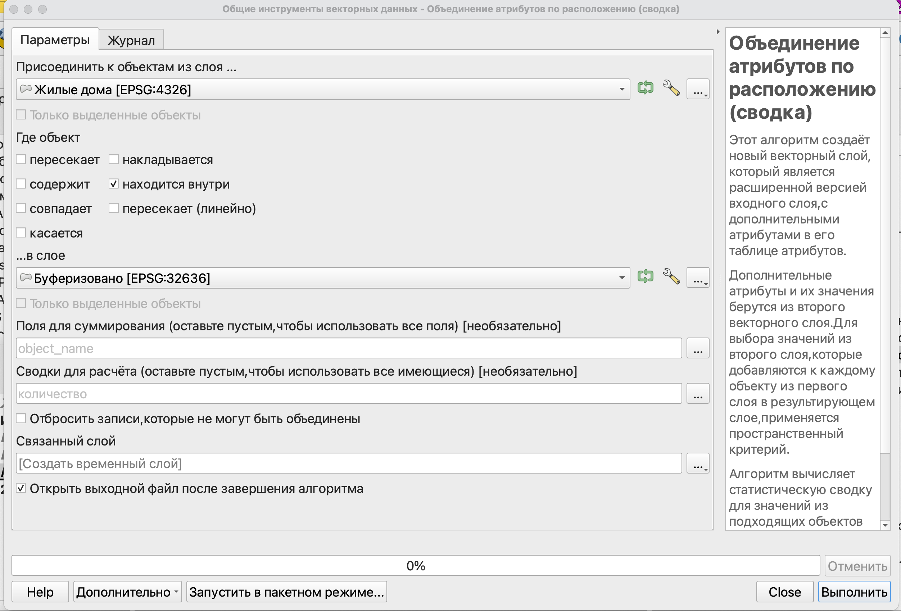

В итоге вы получите слой с исходной геометрией жилых зданий и всеми их атрибутами, к которым будет добавлено атрибут с количеством буферных зон, в которые попало каждое здание.

### Оформление результатов

Добавим зданиям цветовую заливку, цвет которой будет зависеть от рассчитанного нами значения количества доступных школ.

Для этого откроем свойства слоя (двойной клик на названии слоя левой кнопкой мыши или клик правой кнопкой и *Свойства* в открывшемся контекстном меню).

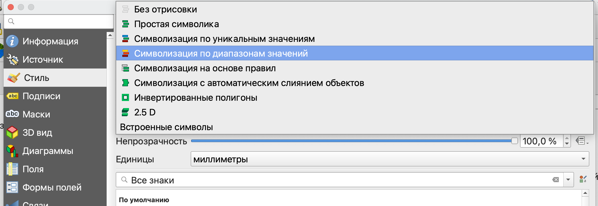

Пункт ***Стиль*** в окне свойств слоя предоставляет необходимые инструменты для отрисовки и стилизации векторных слоев. При этом существуют символов и инструменты для работы с векторными данными в целом, а также специальные типы символов, предназначенные для различных геометрий объектов (точек, линий и полигонов).

Однако для всех видов векторных слоев процесс будет повторяться: в верхней части окна содержатся инструменты для классификации и настройки стиля, а в нижней - опции отрисовки слоя.

Вне зависимости от типа геометрий в слое доступно 4 основных способа отображения объектов:

-   **простой символ** - позволяет отобразить все объекты слоя с использованием одного универсального символа;

-   **символизация по уникальным значениям** - как правило, используется для категориальной или дискретной переменной с небольшим количеством значений, также может использовать выражение в качестве переменной;

-   **символизация по диапазонам значений** - для задания символа в зависимости от числовой переменной, также позволяет использовать выражения;

-   **символизация на основе правил** - позволяет задавать символику на основе выражения.

Для полигонов доступна символизация с автоматическим объединением объектов, где кроме перечисленных выше исходных символизация добавлена символизация 2.5 D, о которой чуть ниже.

{fig-align="center"}

Уникальными только для полигональных объектов типами стиля являются:

{fig-align="center"}

-   **инвертированные полигоны (inverted polygons)** - позволяет делать заливку не внутрь контура, а вовне. Также как и для символизации с автоматическим объединением объектов остальные типы стилей могут выполнять роль исходной символизации;

{fig-align="center"}

-   **2.5 D** - позволяет создать изометрическую проекцию для полигонов.

    {alt="Источник: https://cartetika.ru/tpost/jc36y7ke41-izometriya-v-qgis-osvaivaem-25d"}

В изометрической проекции для полигонов доступна дальнейшая настройка символов аналогично символам стандартных полигонов.

Если мы хотим настроить стиль в зависимости от количественной переменной, необходимо воспользоваться типом стиля *Символизация по диапазонам значений*.

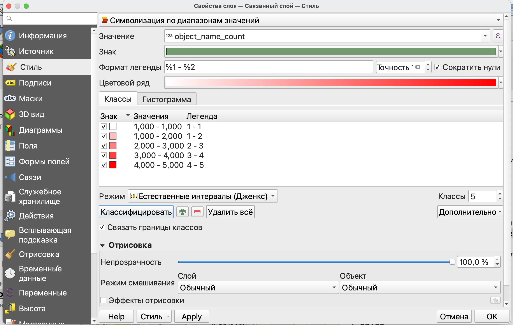{fig-align="center" width="1000"}

Классификация для числовых значений подразумевает разбивку на интервалы.

Самые широко применяемые методы классификации в геоинформационных системах:

-   *Равное количество (квантиль)*: в каждом классе будет одинаковое количество элементов;
-   *Равный интервал*: каждый класс будет иметь одинаковый размер.
-   *Стандартное отклонение*: классы строятся в зависимости от стандартного отклонения значений.
-   *Фиксированный интервал*: каждый класс будет иметь фиксированный диапазон значений (например, при значениях от 1 до 16 и размере интервала 4 классами будут 1-4, 5-8, 9-12 и 13-16).
-   *Логарифмическая шкала*: подходит для данных с широким диапазоном значений.
-   *естественные интервалы* (Natural Breaks (Jenks)): дисперсия внутри каждого класса минимизируется, а дисперсия между классами максимизируется.
-   *форматированные отступы*: вычисляет последовательность из примерно n+1 равномерно распределенных "красивых" значений, которые покрывают диапазон значений x. Значения выбираются таким образом, чтобы они были в 1, 2 или 5 раз больше 10.

Для того, чтобы вручную задать диапазоны, вам нужно дважды кликнуть в графе значения в нужной строке и ввести нижнюю и верхнюю границы диапазона.

Опция *Связать границы классов* автоматически изменит соседний диапазон, чтобы между ними не было пробелов.

Если вы хотите добавить или удалить классы, вы можете сделать это, воспользовавшись кнопками плюса и минуса, расположенными рядом с кнопкой *Классифицировать*.

Изменение текста легенды происходит аналогично ручному изменению границ классов: двойной клик в графе *Легенда* на нужной строке и введение нужного текста с клавиатуры.

::::: callout-warning
Если вы обратили внимание, то часть зданий у вас с карты пропала после того, как вы добавили стилизацию.

Почему так произошло?

Потому что некоторые здания не попали ни в одну из зон доступности и значение нужного атрибута у них *NULL,* то есть пустое значение. Это не позволяет присвоить им определенный цвет в выбранном вами градиенте.

Если вы все-таки хотите показать не только здания с известной нам этажностью, но и те, для которых этих данных нет, можно воспользоваться символизацией на основе правил.

Чтобы минимизировать работу, продублируем слой с уже настроенной символизацией на основе диапазонов значений.

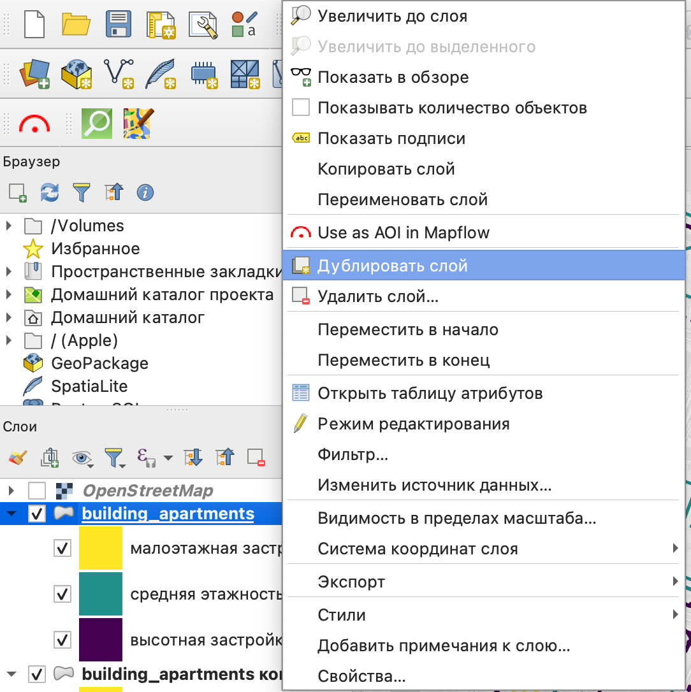{fig-align="center" width="699"}

::: callout-warning
Дубликат слоя будет ссылаться на тот же самый файл, поэтому если вы будете что-то редактировать в нем (форму объектов, атрибуты), то изменения будут отображаться в обоих слоях.
:::

Далее отключим фильтр слоя в полученном дубликате. Для этого откроем опцию *Фильтр* и нажмем *Очистить*.

::: callout-warning
Объекты с неизвестной этажностью у вас на карте пока не появятся, так как они не попадают ни в один из указанных диапазонов для задания стиля объектам, следовательно, не могут быть отрисованы.
:::

Для полученного дубликата слоя выберем *Символизация на основе правил*. Так как у нас уже была настроена символизация по диапазонам первые три правила будут указана автоматически, вам необходимо добавить еще одно.

Для этого нужно нажать на {width="38" height="32"}, после чего в открывшемся окне указать подпись (то, что будет использоваться легенде) и выражение для правила: `"object_name_count" is null`.

Для создания выражения, вы можете воспользоваться конструктором, который открывается нажатием кнопки {width="44" height="41"}.

В окне для задания правила вы можете выбрать цвет заливки для этих зданий так, чтобы он отличался от остальных.
:::::

Просто сохранить карту в виде изображения можно через строку меню *Проект* $\longrightarrow$ *Импорт/Экспорт* $\longrightarrow$ *Экспортировать карту как изображение (Экспортировать карту в PDF).*

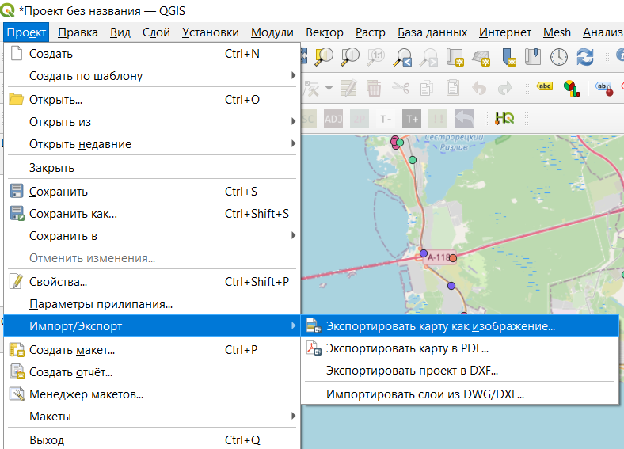{fig-align="center" width="834"}

В открывшемся окне можно настроить масштаб, охват карты, разрешение, аннотации и прочее. Но такой метод не позволяет сделать некоторые точные настройки экспорта.

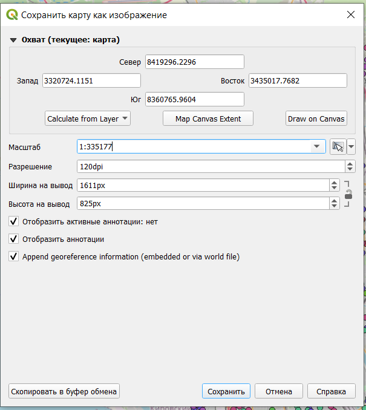{fig-align="center" width="535"}

Некоторые настройки оформления можно добавить через пункт меню *Вид* $\longrightarrow$ *Оформление*.

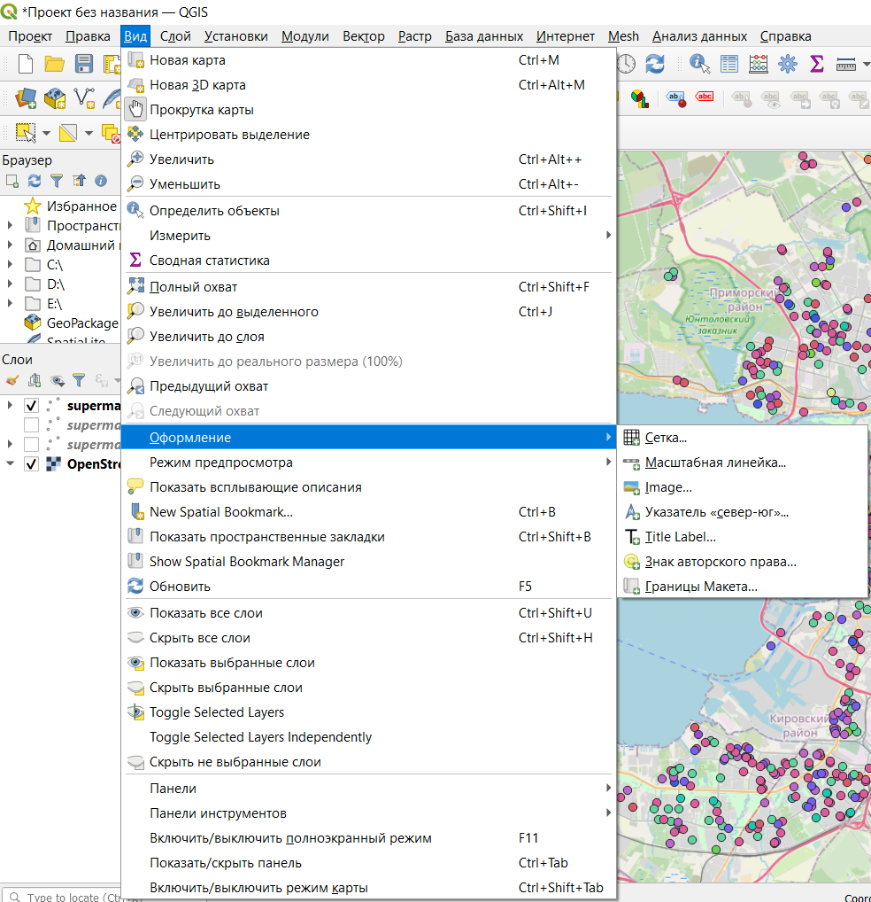

# Создание макета

Более предпочтительным методом публикации являются макеты, которые сохраняются как часть проекта и позволяют кастомизировать результат публикации. Создание макета происходит через строку меню *Проект* $\longrightarrow$ *Создать макет*.

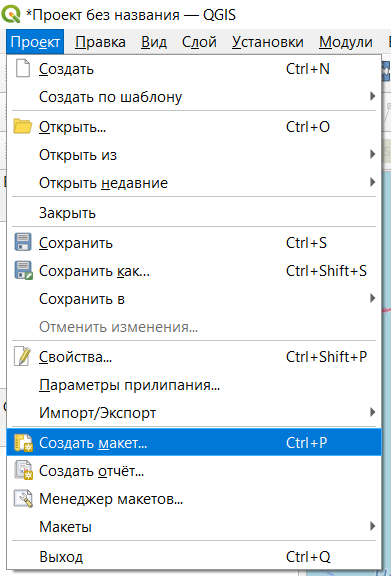{fig-align="center" width="339"}

На этом этапе вам предлагают дать имя вашему макету, вы можете оставить поле пустым, тогда имя будет присвоено автоматически.

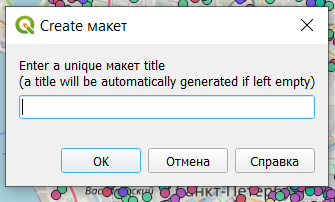

После создания макета открывается отдельное окно, в котором происходит настройка карты для публикации.

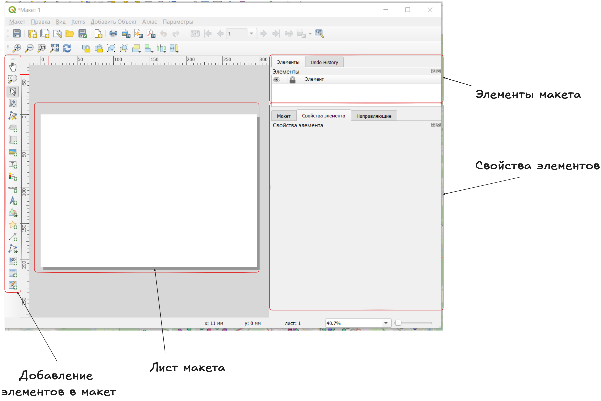{fig-align="center" width="1795"}

По левому краю расположены значки добавления различных элементов оформления на макет, в правой части окна сверху будут перечислены добавленные на макет элементы, а в правой нижней части окна будут отображаться свойства элементов. В центральной части расположен лист, на котором будет размещаться карта и добавленные на нее элементы.

## Параметры листа

Чтобы настроить размер и ориентацию листа, нужно открыть его параметры. Параметры листа открываются в контекстном меню, которое появляется после нажатия правой кнопкой мыши на лист.

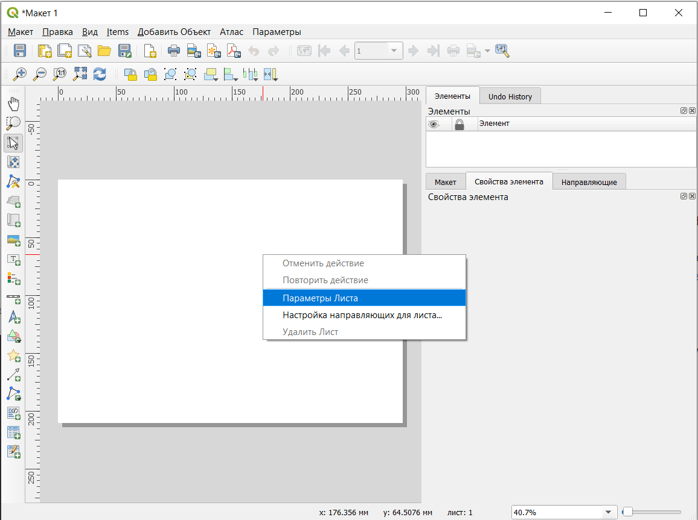{fig-align="center" width="1206"}

После этого в правой части окна появятся настройки параметров листа.

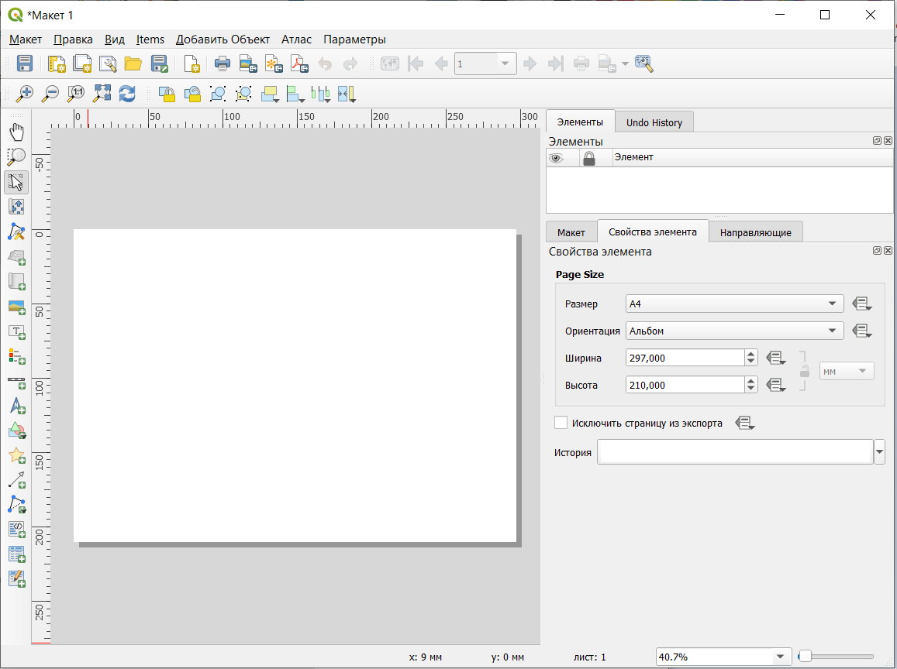{fig-align="center" width="1205"}

Добавить новый лист в макет можно кнопкой *Добавить листы.*

## Добавление карты

Добавление карты на лист осуществляется инструментом **Добавить Карта** на левой панели окна макета 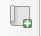.

После выбора этого инструмента нужно щеклнуть на любом месте листа, чтобы карта была добавлена. После этого открывается диалоговое окно, в котором можно настроить положение и размер элемента (не обязательно, так как это положение и размер можно скорректировать вручную уже на листе после добавления).

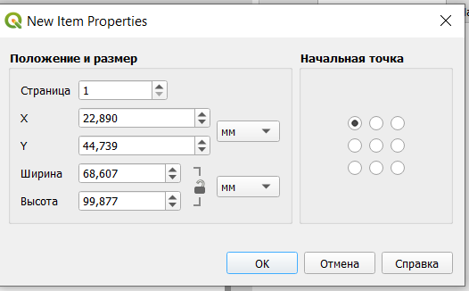{fig-align="center" width="484"}

После добавления карта должна появиться на листе, а в правой части окна появятся ее настройки.

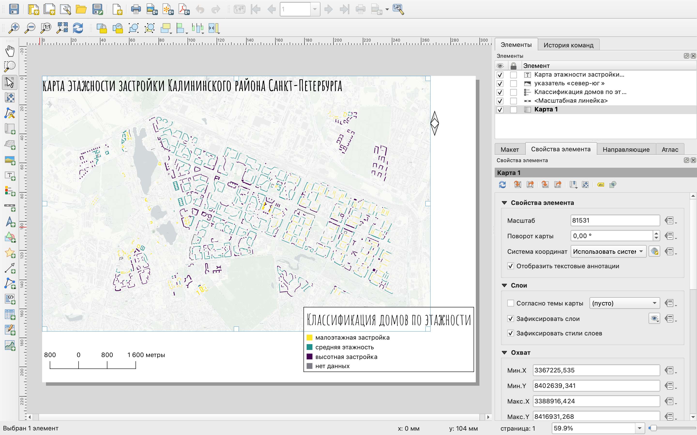

Изменить размер элемента можно просто потянув за один из белых квадратиков по периметру элемента. При этом можно увидеть, что сразу меняется масштаб и границы карты.

На добавленной карте отображаются те слои, которые в данный момент являются видимыми в основном окне программы.

Основные настройки элемента:

-   масштаб - рассчитывается в зависимости от того, какая область попадает в элемент, при необходимости может быть введен нужный знаменатель масштаба;

-   поворот карты - угол поворота, задаваемый в градусах по часовой стрелке относительно направления на север;

-   система координат - система координат, в которой карта отображается на макете, по умолчанию система координат проекта;

-   зафиксировать слои - фиксация содержания карты;

-   зафиксировать стили слоев;

Содержание карты обновляется в соответствии с изменением содержания основного окна карты. То есть при включении/выключении слоев, у вас будет меняться карта на макете. Если вы не хотите, чтобы этого происходило, вы можете зафиксировать слои, то есть перечень видимых на макете слоев.

Фиксация стилей проихсодит аналогично, но замораживает не содержание карты, а оформление слоев на макете.

-   границы помогают задать охват карты.

## Масштабная линейка

Для отображения масштаба карты на нее нужно добавить масштабную линейку (линейный масштаб) с помощью инструмента *Добавить Масштабная линейка* 

Процесс добавлени происходит аналогично добавлению карты на лист.

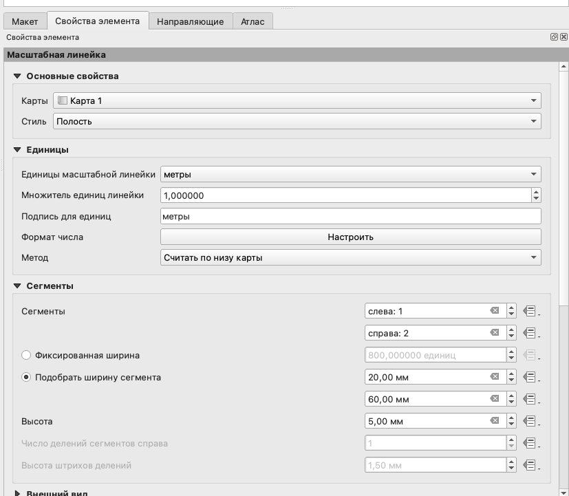{fig-align="center" width="803"}

Основные настройки масштабной линейки:

-   карта - то, для какого элемента карты добавляется линейка (в нашем случае всего один элемент карты, если их несколько можно сделать выбор);

-   стиль линейки

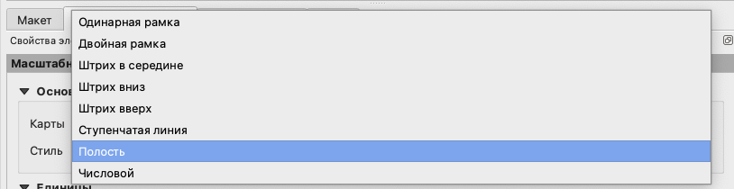{fig-align="center" width="775"}

-   единицы масштабной линейки - единицы измерения на линейном масштабе;

-   множитель единиц масштабной линейки - во сколько раз уменьшить значения на масштабной линейке;

-   подпись единиц измерения;

-   формат числа - формат чисел на линейном масштабе;

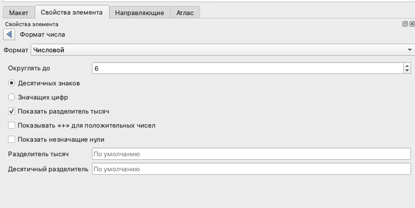{fig-align="center" width="798"}

-   сегменты - количество сегментов слева от нуля и справа от нуля;

-   фиксированная ширина - размер сегмента в единицах измерения карты;

-   подобрать ширину сегмента - размер сегментов линейного масштаба в единицах измерения листа.

## Легенда

Добавим на карту легенду, с помощью кнопки *Добавить Легенда* 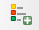.

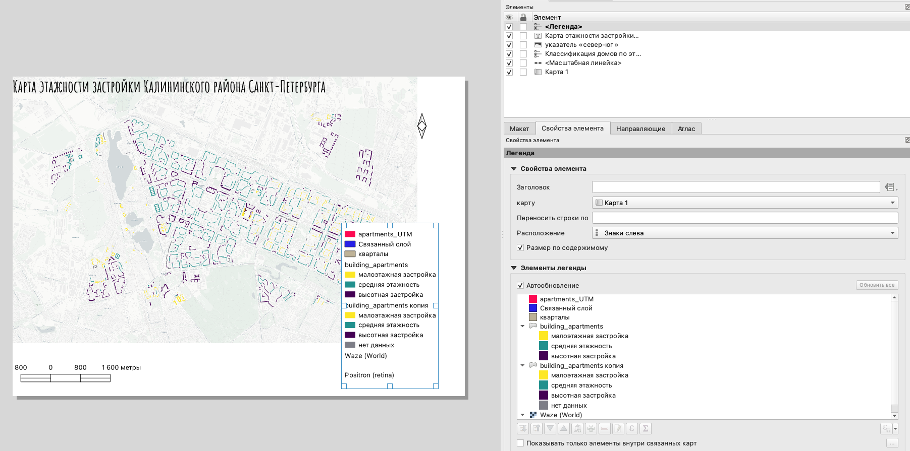{fig-align="center" width="1813"}

По умолчанию на легенду добавляются все слои, которые есть в вашем проекте. Чтобы в легенде отображались только видимые слои, нужно поставить галочку в чекбоксе **Показывать только элементы внутри связанных карт**.

Названия слоев и категорий в легенде отображаются также, как и в основном окне программы, поэтому, чтобы кастомизировать содержание легенды, нужно убрать галочку напротив функции **Автообновление** и после этого осуществить необходимые настройки.

Ненужные для отображения элементы легенды вы можете просто скрыть.

Вы можете подобрать нужный вам шрифт и его размер для каждого типа элементов легенды:

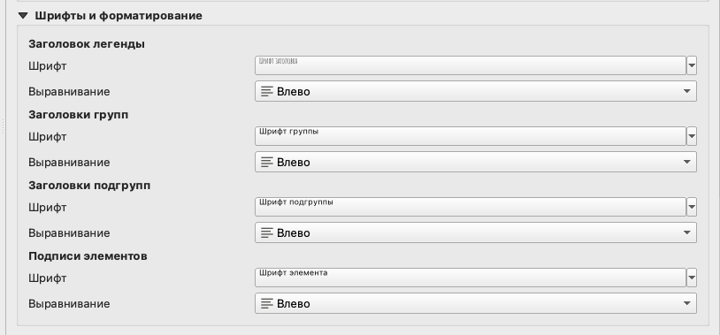{fig-align="center" width="859"}

-   заголовок легенды;

-   заголовки групп - при наличии групп слоев здесь вы можете настроить шрифт для них;

-   заголовки подгрупп - шрифт для названий слоев;

-   подписи элементов - подписи элементов легенды.

Если ваша легенда получилась слишком длинной, вы можете разбить ее на несколько колонок.

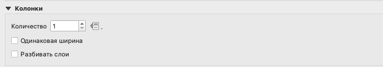{fig-align="center" width="1131"}

Здесь может быть настроено нужное вам число колонок, необходимость их одинаковой ширины (по самой широкой из полученных колонок). Опция *Разбивать слои* здесь необходима в том случае, если вы хотите разбить легенду одного слоя на несколько колонок; если вы не поставите здесь галочку в чекбоксе, то колонки будут разбиваться по слоям.

Отдельно вы можете настроить заливку фона и рамку дл вашей легенды или убрать их совсем.

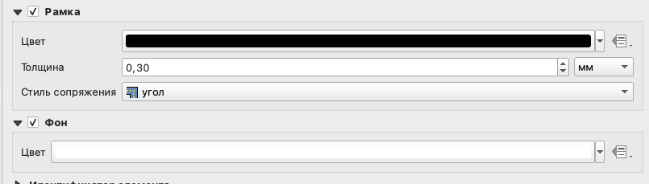{fig-align="center" width="879"}

# Практический кейс 2

## Условия задачи

Найти в зоне доступности школ объекты:

-   наличие которых было бы плюсом в непосредственной близости от школы;

-   наличие которых нежелательно в вблизи от школы.

::: callout-important
Перечень таких объектов вы можете определить самостоятельно (как лично, так и на основе консультации с учениками), так и воспользоваться нормативной документацией.
:::

Рассчитать количество объектов каждого из типов в зоне доступности школы.

Определить в окрестности каких школ количество нежелательных объектов превышает количество положительных объектов.

::: callout-note
Зоны доступности вокруг школ у вас уже построены в предыдущем задании.
:::

## Порядок решения задачи

### Поиск объектов

В первую очередь необходимо определиться с перечнем "хороших" и "плохих" объектов, которые мы будем учитывать, и скачать их местоположение из OSM.

::: callout-note
Все значения тегов можно посмотреть на странице [Объекты карты](https://wiki.openstreetmap.org/wiki/RU:%D0%9E%D0%B1%D1%8A%D0%B5%D0%BA%D1%82%D1%8B_%D0%BA%D0%B0%D1%80%D1%82%D1%8B), если вам необходимы дополнительные пояснения, то можно обратиться к странице [Как обозначить](https://wiki.openstreetmap.org/wiki/RU:%D0%9A%D0%B0%D0%BA_%D0%BE%D0%B1%D0%BE%D0%B7%D0%BD%D0%B0%D1%87%D0%B8%D1%82%D1%8C).

На русском перечень ключей и значений с пояснениями можно найти в [таблице](https://docs.google.com/spreadsheets/d/1YgTDaw160aZ60DPUxuJrfYGyGykKJQDZE3c0W2O-OSY/edit?usp=sharing).
:::

Расчет количества объектов, попавших в зону доступности, осуществляется аналогично первому практическому кейсу.

### Оформление результата

Расчет числа преобладающих объектов вы можете сделать в виде отдельного атрибута на основе условного выражения.

Для этого вы таблице атрибутов вам нужно открыть *Калькулятор полей* 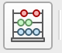{width="44" height="38"}.

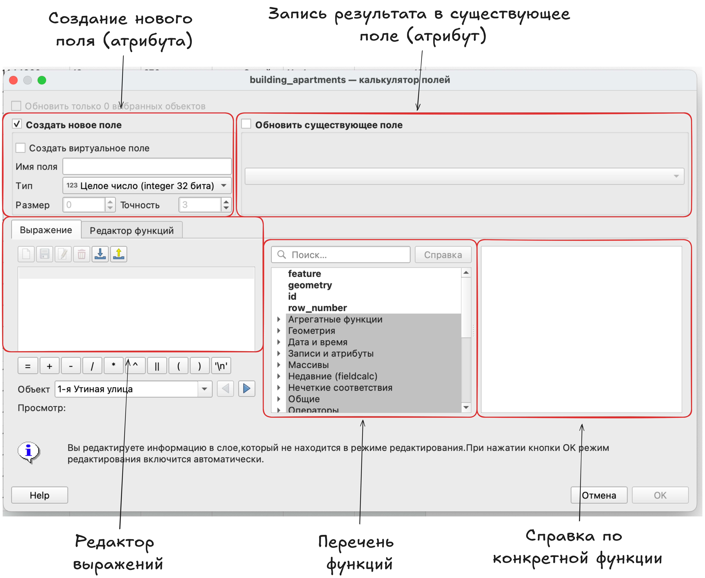{fig-align="center" width="1000"}

::: callout-important
Если вы хотите создать новое поле, то для него нужно обязательно указать имя и тип данных, без этого поле создано не будет. *Имя поля должно быть уникальным в пределах таблицы*.

Если вы будете записывать результат в уже существующее поле (*Обновить существующее поле*), то удостоверьтесь, что тип данных этого поля соответствует типу данных, который будет получен в результате выражения.
:::

Пример условного выражения показан ниже.

```         
if ("хорошее" > "плохое",'хорошо', 'плохо')
```

В данном случае используется простое условие *если*. В скобках в первую очередь указывается само условие, потом, что какое значение необходимо указать, если условие будет выполнено. После второй запятой указывается, какое значение нужно присвоить, если условие не было выполнено.

После того, как вы получите свой рассчитанный атрибут, вы можете настроить стиль слоя на его основе.

::: callout-tip
Похожее выражение условия вы можете прописать вместо значения конкретного атрибута при настройке стиля.

В этом случае создавать новый атрибут будет не нужно.

Также вы можете избежать необходимости создавать новый атрибут, воспользовавшись символизацией на основе правил.
:::
