# Педагогическая лаборатория цифровой городской среды "Городские услуги и сервисы"

# Установка программы

Официальный сайт программы: <https://qgis.org/>

Официальная документация: <https://qgis.org/resources/hub>

::: callout-warning
Курс разработан на основе версии ***QGIS 3.40.***

Пока *не нужно устанавливать новую мажорную версию QGIS 4.x.*
:::

## Установка программы на Windows

Скачать программу можно по ссылке <https://qgis.org/download/>

Скорее всего после перехода по ссылке вы увидите форму для отправки пожертвования в фонд развития программы. Здесь вы можете просто нажать на кнопку *Skip it and go to download*, чтобы перейти к загрузке установщика.

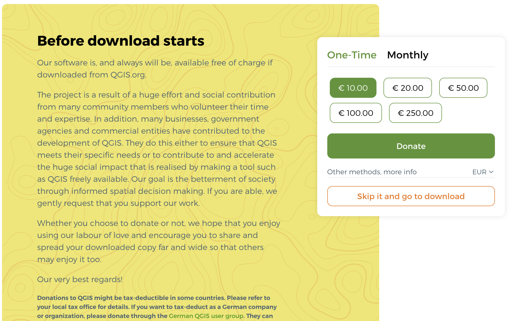{width="956"}

Для системы Windows доступно две версии установщика:

-   Online (OSGeo4W) installer - онлайн установщик, который сразу будет устанавливать не только эту программу, но и еще некоторые дополнительные;

-   offline (standalone) installer - обычный установочный файл, который вы скачиваете и запускаете на компьютере; этот вариант более простой и понятный, рекомендую использовать его.

{fig-align="center"}

::: callout-tip
Если у вас возникла сложность с доступом к сайту, то вы можете скачать установщик по прямой ссылке <https://qgis.org/downloads/QGIS-OSGeo4W-3.40.10-1.msi>
:::

После запуска установщика вы увидите окно мастера установки, в котором нужно перейти *Далее*.

На следующем этапе согласиться с условиями использования, выбрать папку для установки.

После завершения установки программа должна появиться у вас в меню **Пуск** и в виде папки на рабочем столе, из которой доступен ярдык запуска программы.

## Установка программы на MacOS

Скачать версию для MacOS можно на той же странице <https://qgis.org/download/>

{fig-align="center"}

::: callout-tip
Если есть проблема с доступом к сайту, можно скачать по прямой ссылке <https://qgis.org/downloads/macos/qgis-macos-ltr.dmg>
:::

После запуска установщика вам нужно принять лицензионное соглашение, дождаться распаковки файла. После распаковки вы увидите окно, в котором нужно просто перетащить ярлык программы в папку с приложениями.

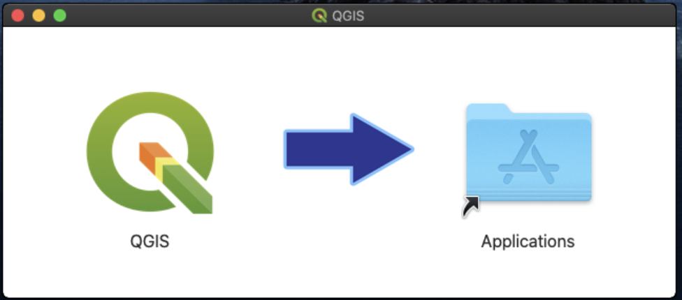{fig-align="center" width="681"}

::: callout-important
При первом запуске программы вам может потребоваться разрешение на использование приложения. Для этого нужно перейти в настройки и включить соответствующие разрешения.

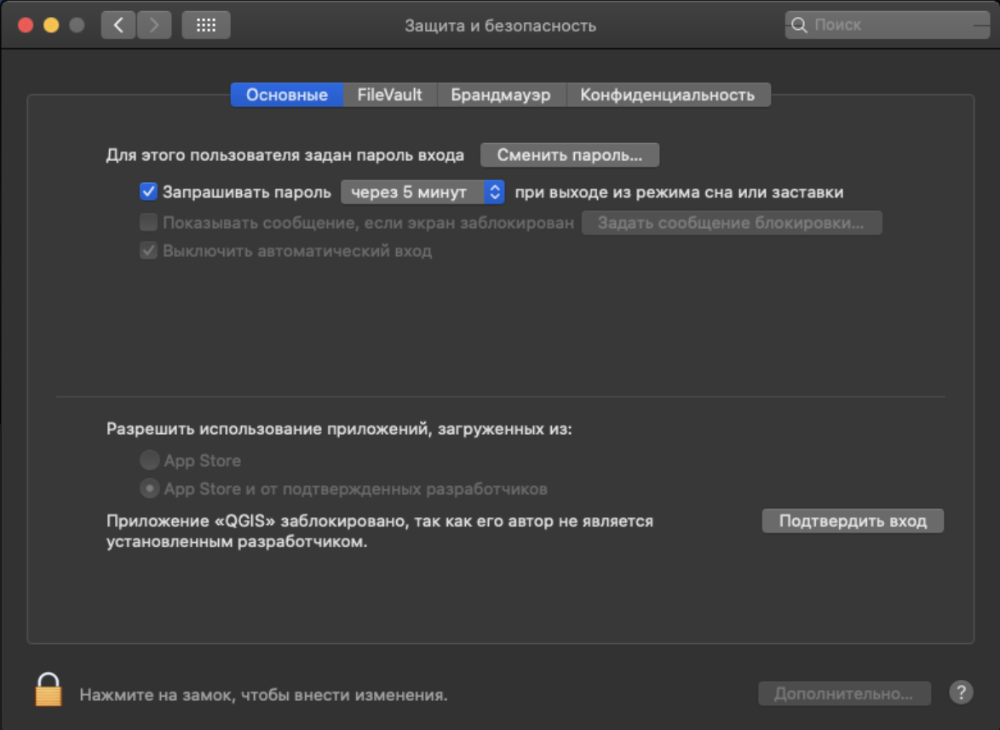{fig-align="center" width="684"}
:::

# Основные элементы интерфейса {#interface}

Основным способом работы с ГИС является использование графического пользовательского интерфейса.

Если вы только начинаете работать с QGIS, то у вас не будет отображаться панель с перечислением недавних проектов.

::: {#imp-layer .callout-important}
У нас с вами есть два специфичных для ГИС понятия, с которыми мы будем постоянно встречаться:

-   **слой** - как правило, это набор однотипных объектов, хранящихся в одном файле, или растровый файл с геопривязкой, или подключение к удаленному источнику (картографическому сервису или базе данных);

-   **проект** - это ваш сеанс работы, в котором хранится информация о всех открытых в данных момент слоях, их стилях, макетах и геомоделях.
:::

::: callout-tip
Если ваша панель инструментов отличается от того, что на картинке, то не пугайтесь: у меня установлены некоторые модули, которые добавлены туда. Впоследствии некоторые эти модули появятся и на вашей панели инструментов.
:::

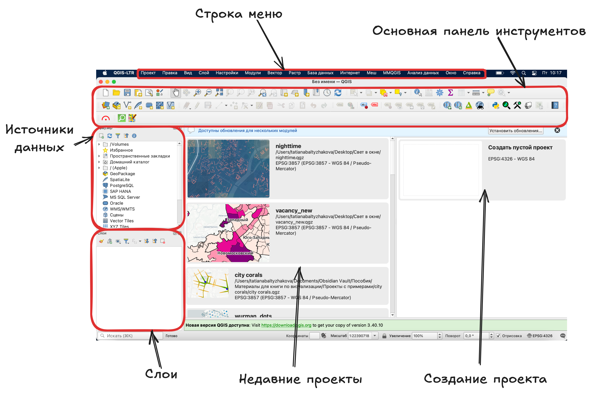{fig-align="center"}

-   панель *Браузер* отображает все доступные вам источники данных как локальные (файлы на вашем компьютере), так и удаленные (базы данных и подключение к картографическим сервисам);

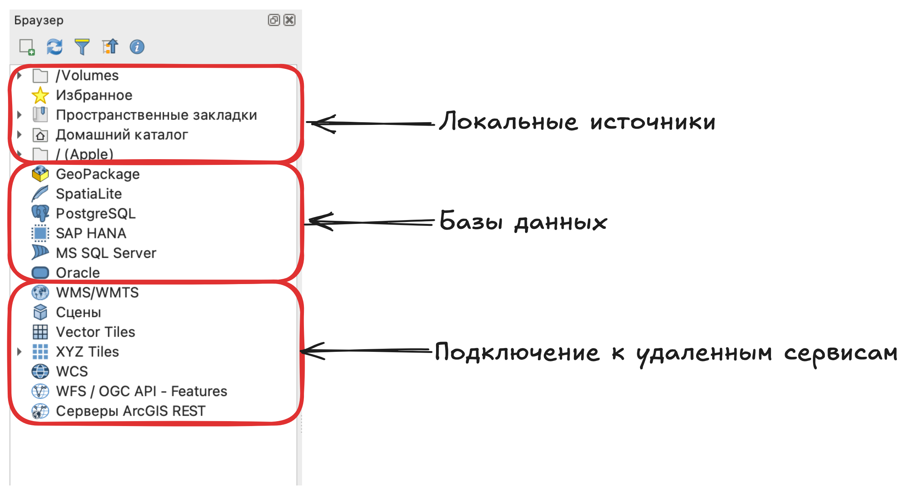{fig-align="center" width="653"}

-   панель *Слои* будет отображать все открытые в данный момент слои вашего проекта.

Если вы закрыли панель браузера и/или панель слоев, то вы можете открыть их снова из строки меню: *Вид* $\longrightarrow$ *Панели* $\longrightarrow$ *Браузер* или *Слои*.

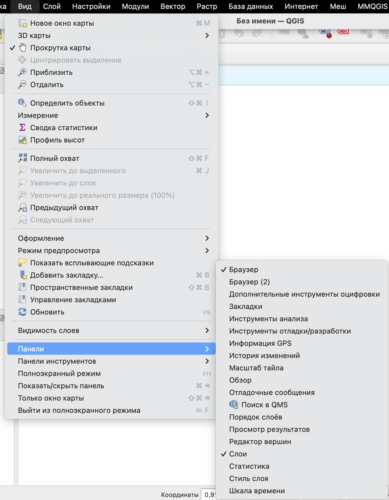{fig-align="center" width="622"}

После того как вы создадите свой первый пустой проект вы увидите пустое рабочее пространство, которое в некоторых контекстах и документации может называться холстом.

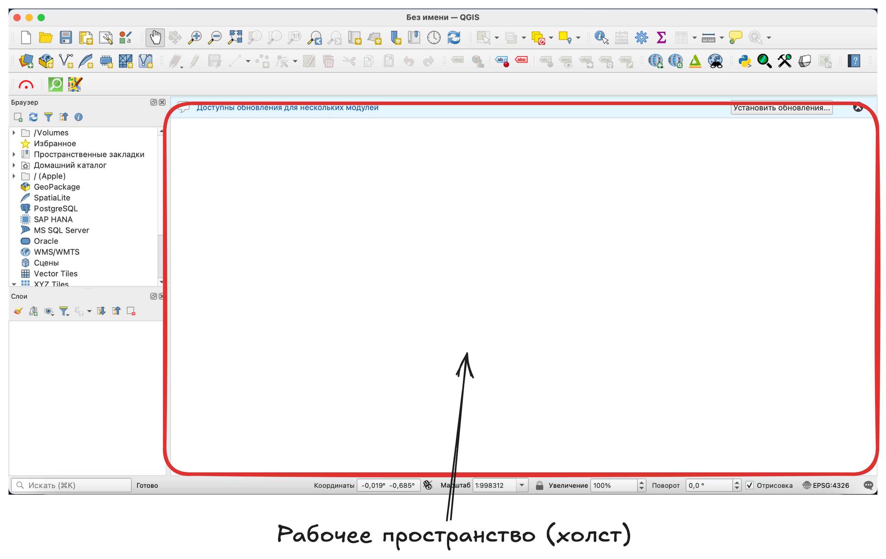

На основной панели инструментов, как правило, отображаются базовые инструменты работы, некоторых из которых подписаны на картинке. Она может дополняться как некоторыми инструментами из основного набора, так и некоторыми инструментами из дополнительных модулей.

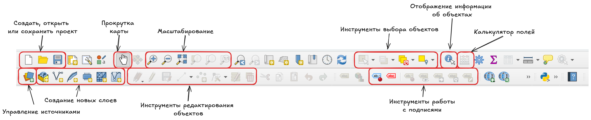

::: callout-tip
Что такое модуль?

Это либо дополнительные инструменты для расчетов, которых нет в базовом наборе, либо инструменты, предоставляющие возможность взаимодействия с удаленными источниками (например, загрузка данных).
:::

В нижней части окна есть некоторые дополнительные инструменты взаимодействия с рабочим пространством.

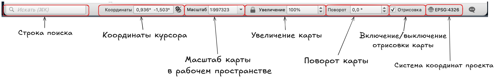

-   строка поиска позволяет искать искать объекты по названию[^1];

-   далее показаны координаты вашего указателя мыши в системе координат проекта, по клику на значок мыши справа вы можете переключить эту строку в режим отображения охвата (то есть минимальных и максимальных координат видимой в рабочем пространстве карты)[^2];

-   масштаб, который может быть выбран из линейки стандартных (из выпадающего списка) или задан числом с клавиатуры;

-   увеличение позволяет увеличить изображение видимого фрагмента карты без изменения масштаба (как увеличительное стекло), требует фиксации масштаба кликом на значок замка;

-   поворот карты, который задается в градусах по часовой стрелке от направление на север;

-   включенная опция отрисовки карты значит, что изображение видимого в рабочем пространстве фрагмента карты будет меняться при перемещении и/или масштабировании, если вы ее отключите, то зафиксируете содержание карты;

-   система координат проекта.

[^1]: <https://docs.qgis.org/3.40/en/docs/user_manual/introduction/qgis_gui.html#locator-bar>

[^2]: здесь заложены некоторые "пасхалки" от разработчиков, почитать про них можно (на англ.) <https://www.geographyrealm.com/qgis-easter-eggs/> или (на русском) <https://cartetika.ru/tpost/1h9c4oc5o1-pashalki-v-qgis>

::: callout-important
Система координат проекта в первую очередь задает систему координат для той карты, которую мы видим в основном рабочем пространстве, кроме того, в ней могут осуществляться некоторые расчеты (в зависимости от инструмента).

Эта система координат не зависит от систем координат слоев и считается внешней для них.
:::

# Добавление подложки на карту

Для начала работы добавим в наш проект подложку.

Подложкой в ГИС называют то, что используется как фоновое изображение, как правило, это может быть карта в виде тайлов или какое-либо изображение (спутниковый снимок, растр с геопривязкой).

Подложка необходима для добавления контекста на карту, возможности ориентирования на местности, а также она может выполнять эстетическую функцию при подготовке и оформлении карт.

По умолчанию на панели браузер нам доступны два варианта подложек в формате **XYZ Tiles**:

-   *OpenStreetMap* - подложка на основе данных OpenStreet Map;

-   *Mapzen Global Terrain* - подложка на основе сведений о рельефе.

По двойному клику левой кнопкой мыши вы можете добавить любую из них.

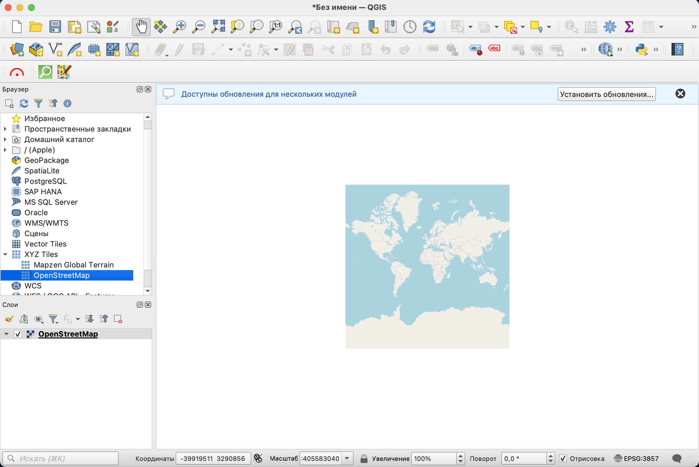

После добавления она должна появиться в рабочем пространстве и в панели слоев.

Обратите внимание, что слева от названия подложки в панели слоев нарисован квадратик с разноцветными ячейками, это значит, что **слой растровый**.

::: callout-tip
При необходимости вы можете сами создавать и настраивать подключения к картографическим сервисам.
:::

## Модуль QuickMapServices

Если подложек по умолчанию вам недостаточно, то вы можете как настроить новые подключения к другим сервисам, так и воспользоваться модулем (плагином) **QuickMapServices**, который предназначен для добавления геосервисов и базовых карт.

Информацию о всех доступных модулях вы можете посмотреть на официальном сайте репозитория - <https://plugins.qgis.org/>

Для установки модуля в строке меню нужно выбрать *Модули* $\longrightarrow$ *Управление модулями*, после чего вы увидите окно репозитория (возможно понадобится пара секунд, чтобы в нему подключиться), в котором можно найти интересующий вас модуль и установить.

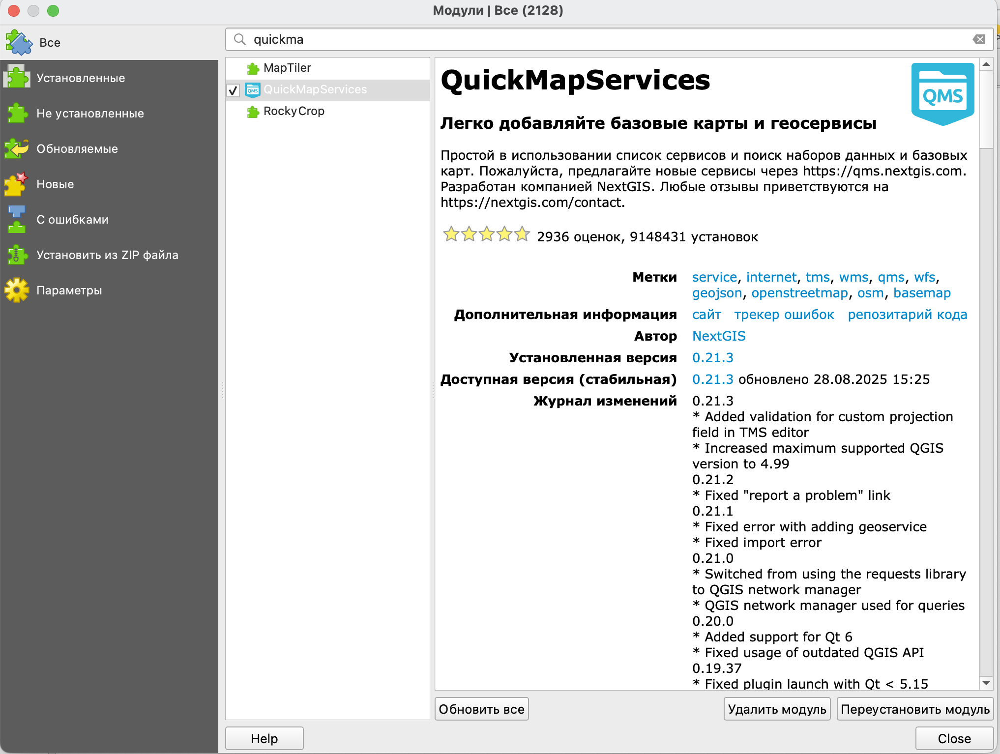{fig-align="center" width="1193"}

В том случае, если по какой-то причине вы не можете подключиться напрямую к репозиторию из программы и установить нужный вам модуль, вы можете скачать архив с модулем с сайта <https://plugins.qgis.org/> и установить его, воспользовавшись опцией *Установить из ZIP файла*.

После успешной установки модуля у вас в правой части окна появится панель поиска геосервисов, где вы можете искать их по текстовому запросу.

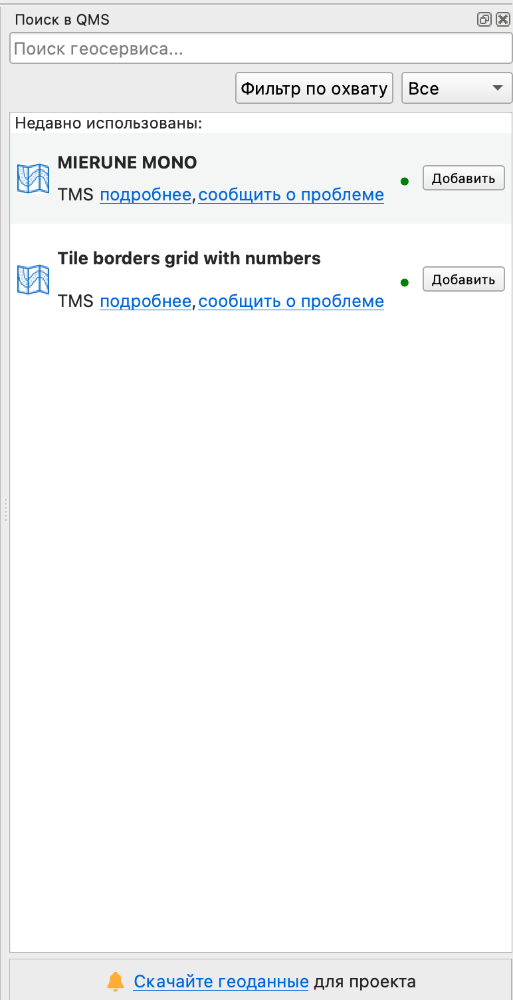{fig-align="center" width="463"}

Если вы не хотите этого делать, панель можно просто закрыть.

Также на вашей основной панели инструментов должен появиться значок 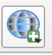{width="51"}, по клику на который вы увидите перечень доступных вам геосервисов и базовых карт.

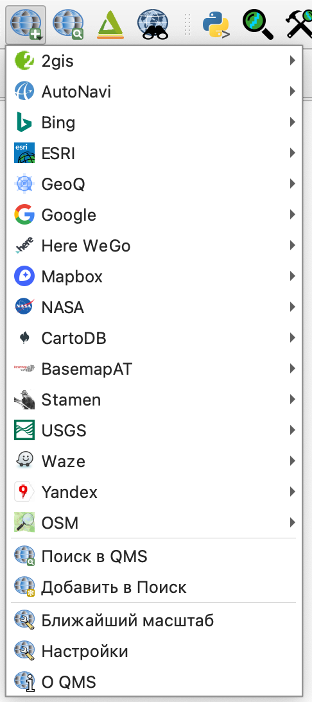{fig-align="center" width="355"}

::: callout-important
При первой установке модуля у вас не будет такого большого перечня, как показано на картинке. Если вы хотите открыть к нему доступ, то вам нужно перейти в настройки модуля и открыть вкладку *Загрузить сервисы* (*Load more services*).

В этом окне вам нужно нажать на кнопку *Получить дополнительные источники данных* (*Get contributed pack*), согласиться с условиями их предоставления и сохранить настройки.

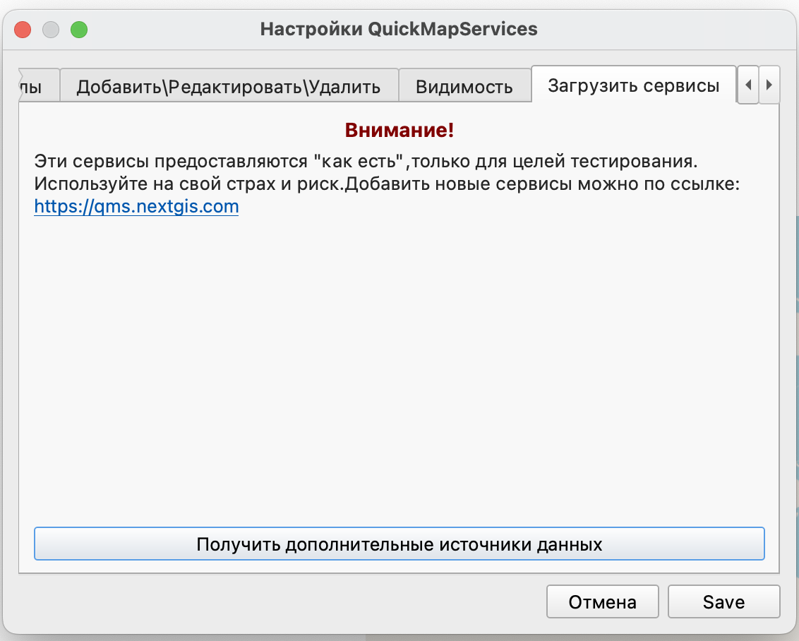{fig-align="center" width="997"}
:::

::: callout-tip
Со списком всех доступных сервисов можно ознакомиться по ссылке <https://qms.nextgis.com/>

Для более подробного ознакомления можете воспользоваться видео от разработчиков.

```{=html}
<iframe width="560" height="315" src="https://www.youtube.com/embed/lw_v0GlZzcE?si=XUOspMhzjY7zuhi_" title="YouTube video player" frameborder="0" allow="accelerometer; autoplay; clipboard-write; encrypted-media; gyroscope; picture-in-picture; web-share" allowfullscreen></iframe>
```
:::

::: callout-tip
Возможно после открытия новой подложки она появилась у вас в перечне слоев, но не видна на карте, это происходит из-за того, что отрисовка слоев ведется в том порядке, в котором они перечислены, то есть слои ниже по списку находятся под более верхними слоями, которые их закрывают.

При необходимости вы можете поменять порядок слоев, просто перетащив один из них в списке выше или ниже, или отключить видимость верхнего слоя, убрав галочку из чекбокса.
:::

## Настройка базовой карты

Так как базовые карты подложки у нас растровые, то настройка их стиля довольно ограничена, хотя вы можете сделать так, чтобы они отвечали общему стилю и задумке вашей карты.

Настройки стиля можно найти в свойствах слоя, которые открываются либо двойным кликом по названию, либо из контекстного меню, полученного кликом правой кнопки мыши.

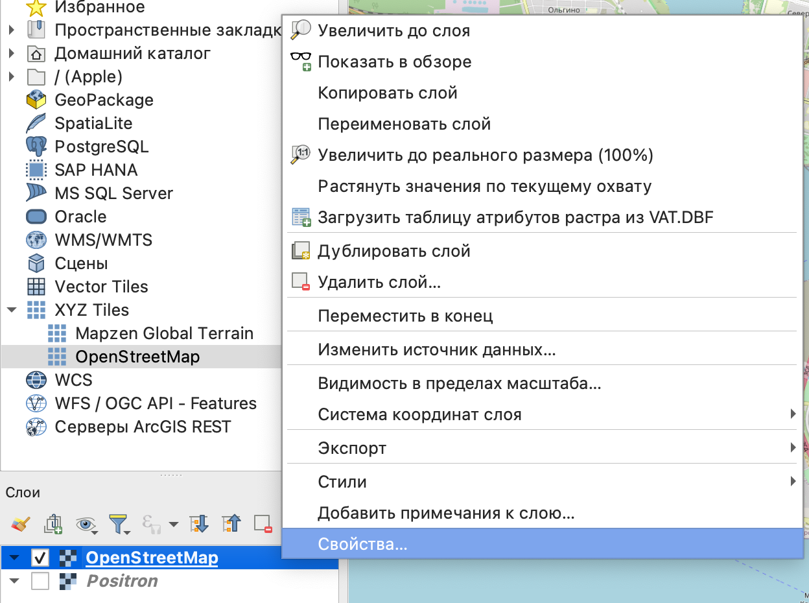{fig-align="center" width="939"}

В свойствах вы увидите несколько пунктов, нас интересует пункт *Стиль*.

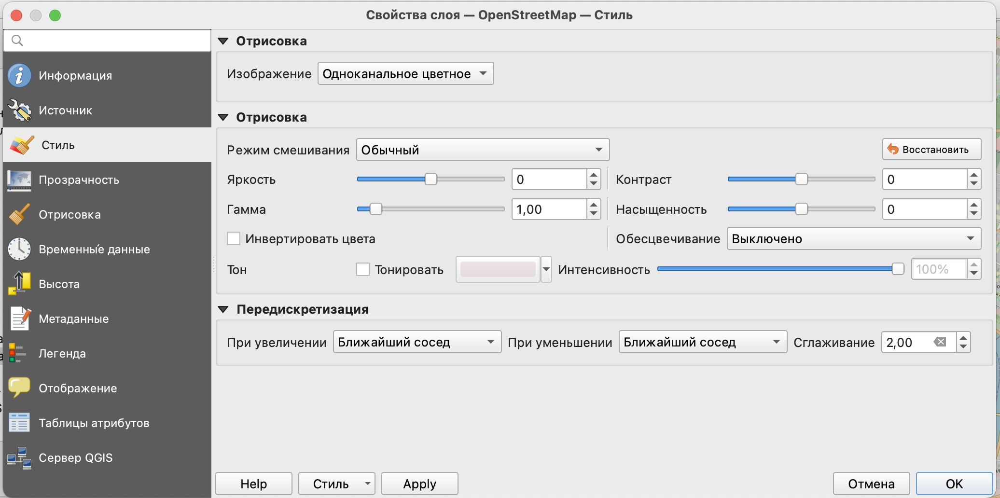{fig-align="center" width="1807"}

### Черно-белая подложка

Если вы хотите получить черно-белый вариант цветной подложки, то вы можете снизить насыщенность до минимума.

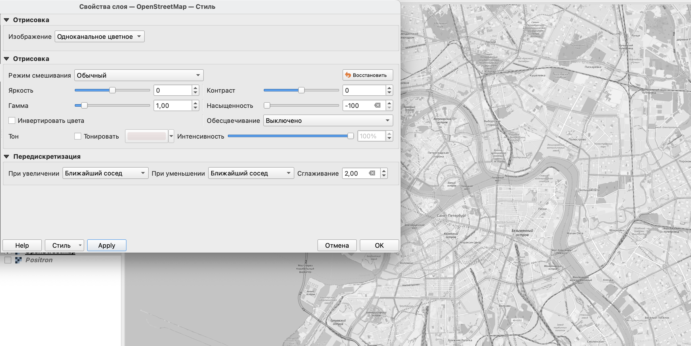

Вторым способом будет добавление обесцвечивания.

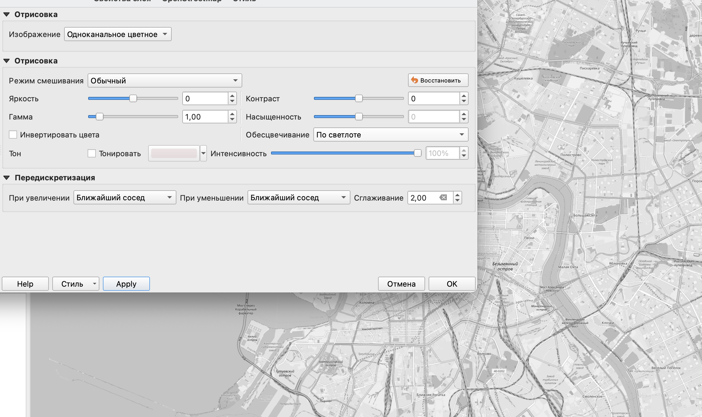

Если вы обесцветите изображение, а потом инвертируете, то вы получите темный вариант подложки.

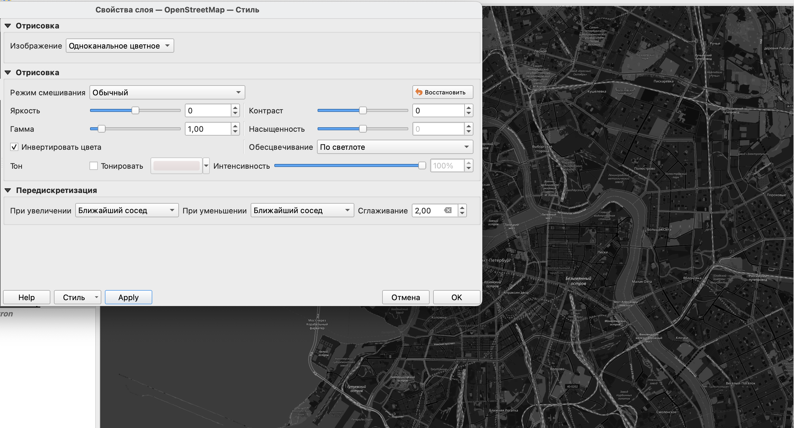

При использовании преимущественно монохромной подложки инвертирование превратит светлую карту в темную и наоборот: темную в светлую.

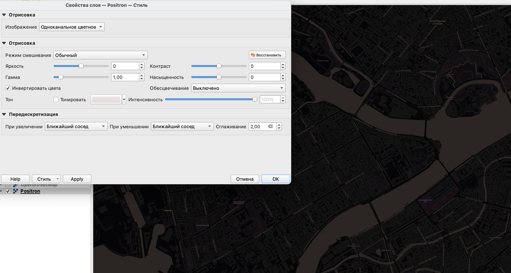

### Тонирование карты

Подложку как любое растровое изображение можно тонировать в тот оттенок, который вы посчитаете нужным.

Для этого нужно поставить галочку слева от слова *Тонировать* в настройках стиля и выбрать нужный цвет. Настройка интенсивности здесь позволяет выбрать степень тонирования.

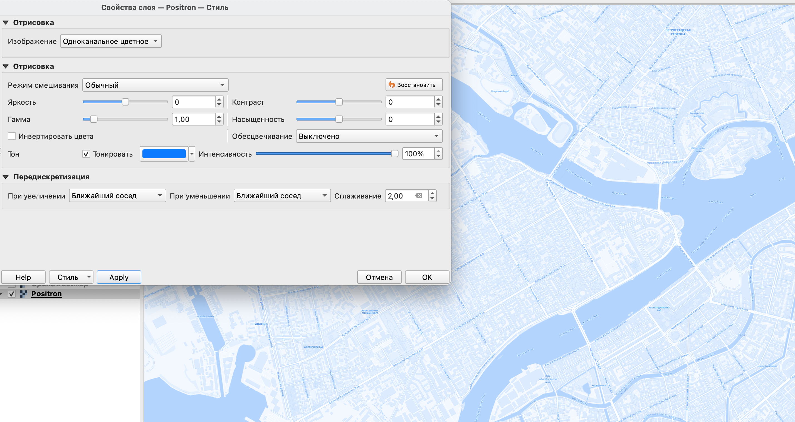{fig-align="center" width="1880"}

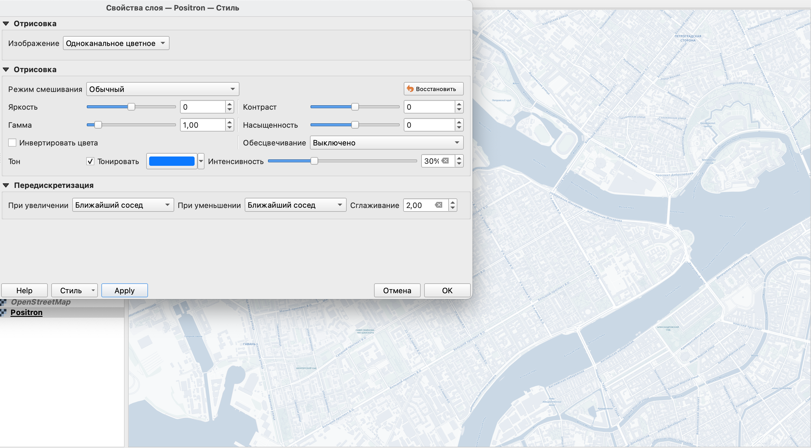{fig-align="center" width="1808"}

Использование одновременно нескольких настроек позволяет добиться дополнительного художественного эффекта.

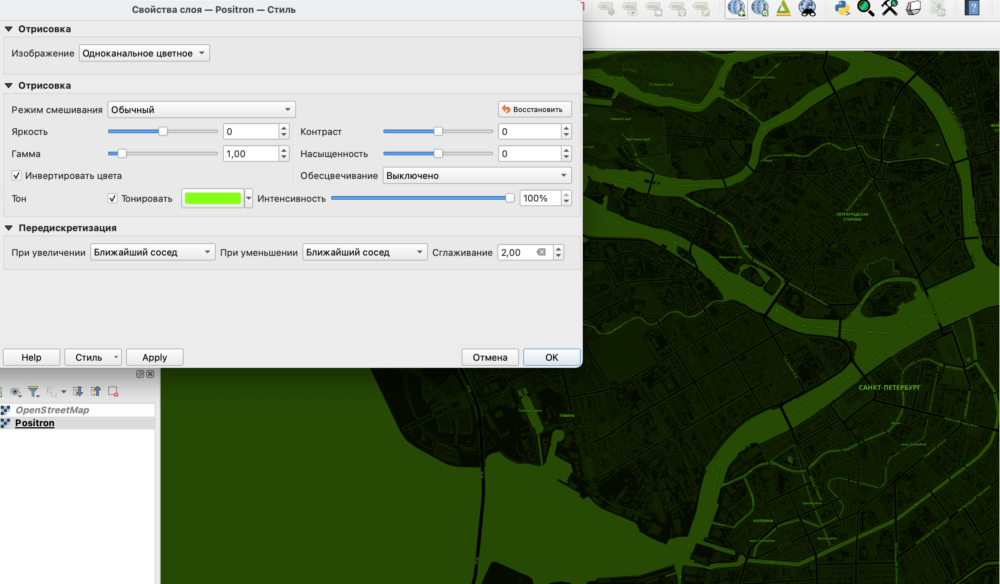

::: callout-tip
Для загрузки подложек/базовых карт есть еще модуль [HCMGIS](https://plugins.qgis.org/plugins/HCMGIS/), который позволяет загружать в том числе общедоступные векторные тайлы.

Почитать про работу с ним можно по [ссылке](https://mapscaping.com/hcmgis-plugin-in-qgis/) (англ.).
:::

# Работа с векторными слоями

## Создание слоя

Новый векторный слой можно создать из панели инструментов (кнопка 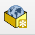{width="39"} *Создать слой GeoPackage*) или из строки меню: *Слой* $\longrightarrow$ Создать слой.

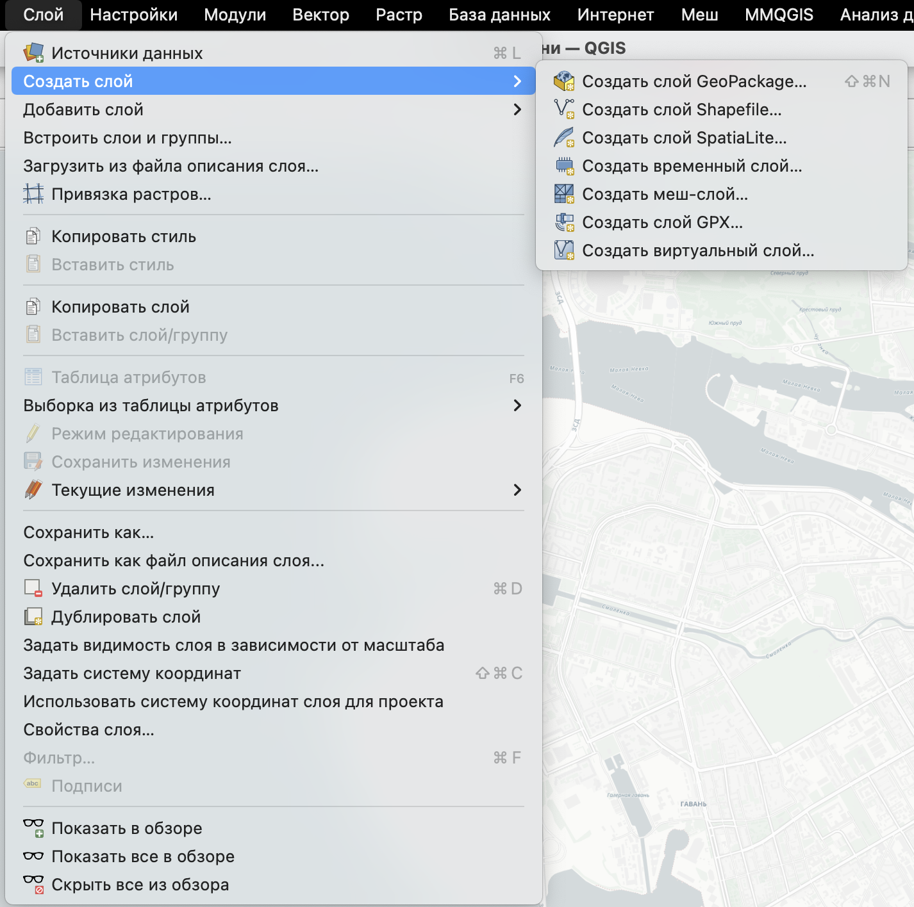{fig-align="center" width="906"}

::: callout-important
На этом этапе вам сразу нужно выбрать тип файла, который вы будете создавать. Рекомендую выбирать формат GeoPackage.
:::

Далее необходимо выбрать куда и под каким именем вы будете сохранять свой файл. Так как у меня на картинке показан именно GeoPackage, то вместо слов *Имя файла* указано *База данных*.

::: callout-caution
В пункте *База данных* (или *Имя файла*) недостаточно указать просто имя файла, там должен быть отображен полный путь к файлу, поэтому необходимо нажать кнопку обзора 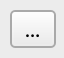{width="39" height="36"}, выбрать папку для сохранения и задать имя файла.
:::

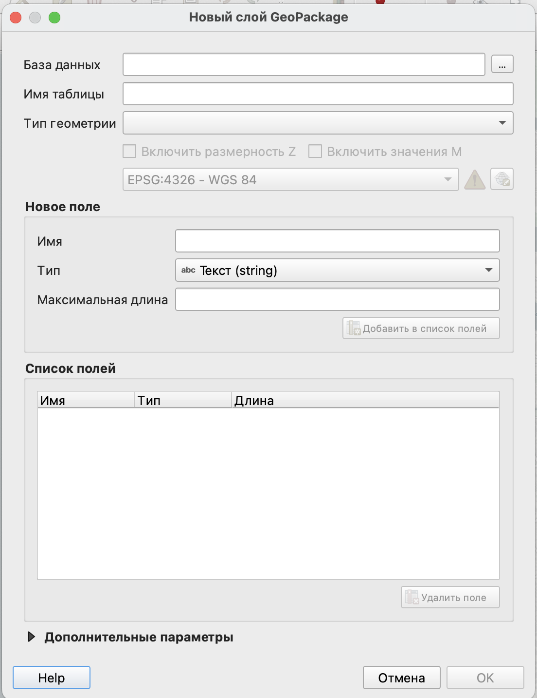{fig-align="center" width="617"}

*Имя таблицы*, как правило, соответствует имени файла.

Тип геометрии вы для создания примера можете выбрать любой, в моем случае будут рассмотрены полигоны, так как они дают больше всего возможностей для редактирования.

По типом геометрии вам предлагают выбрать систему координат для слоя, предлагая одну из них по умолчанию. О системах координат мы поговорим чуть позднее, поэтому пока оставим предложенный нам вариант.

Ниже под заголовком **Новое поле** вы можете создать структуру своей атрибутивной таблицы, то есть какие столбцы с какими названиями и типами данных в ней будут. Для этого нужно указать имя столбца и тип данных.

::: callout-important
Имена столбцов обязательно должны быть уникальными.
:::

Если на этом этапе вы ошибетесь в списке полей или вообще ничего не укажете, то это не страшно, так как потом вы можете отредактировать это средствами работы с таблицей атрибутов.

Для того, чтобы столбец был добавлен в таблицу атрибутов, нужно нажать кнопку *Добавить в список полей*, после чего он будет отображен в списке ниже.

Очень рекомендую впоследствии стараться давать осмысленные имена своим слоям и файлам, чтобы вы могли без проблем вспомнить, что в них хранится.

После создания слой появится в вашей панели слоев. Обратите внимание, что слева от названия слоя будет показана точка для слоя с точечными объектами, линия - для слоя с линейными объектами и квадрат - для слоя с полигональными объектами.

При этом изображение на карте у вас не поменялось, так как пока у вас не было добавлено никаких объектов в слой.

::: callout-important
Обратите внимание, что при клике на название слоя, оно подсвечивается, таким образом показывается **активный слой**. Все действия, выполняемые в программе происходят с активным слоем.
:::

## Создание и редактирование объектов

Для того, чтобы начать создание объектов, слой необходимо сделать редактируемым. Это осуществляется либо путем нажатия на кнопку *Начать редактирование* 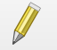{width="41"}, либо из контекстного меню слоя.

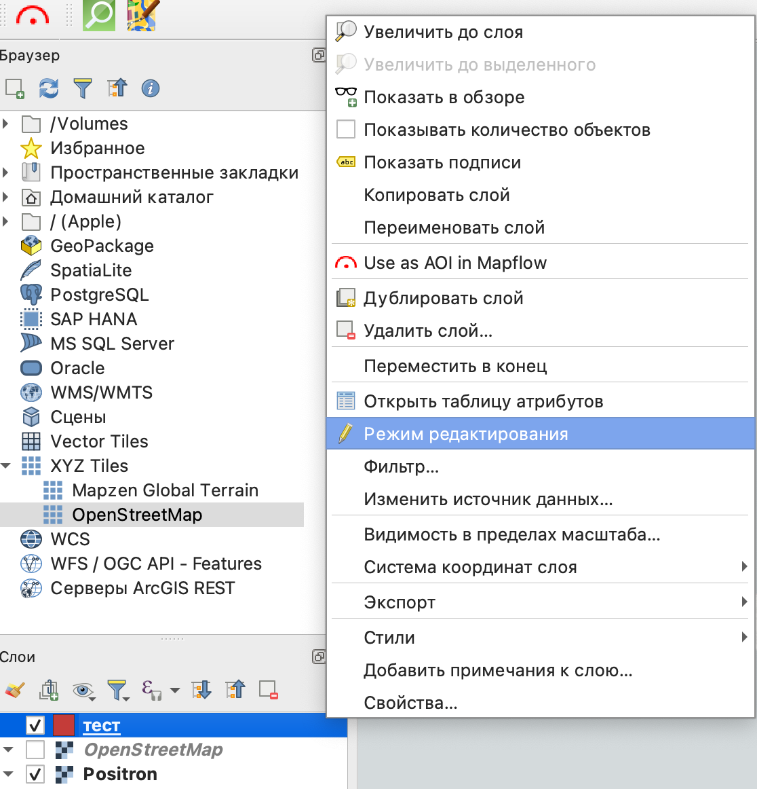{fig-align="center" width="672"}

После того, как слой стал перешел в режим редактирования слева от его имени появится знак карандаша, символизирующий этот статус, а основная панель инструментов изменится и на ней активируются инструменты создания и редактирования векторных объектов.

```{=html}
<video width="800" height="600" controls>
  <source src="images/Запись экрана 2025-09-19 в 16.37.38.mp4" type="video/mp4">
</video>
```

По умолчанию создание объекта здесь выполняется сегментами, то есть отрезками прямых линий между поворотными точками. Каждая поворотная точка указывается кликом левой кнопки мыши, а завершение отрисовки происходит по клику правой кнопки.

Отметить отрисовку объекта можно просто нажав в процессе кнопку *Escape* на клавиатуре.

Создание точечных объектов происходит по клику, а линейные создаются похоже на полигональные, только по завершении отрисовки не дополняются до замкнутого контура.

Другие доступные опции кроме оцифровки сегментами:

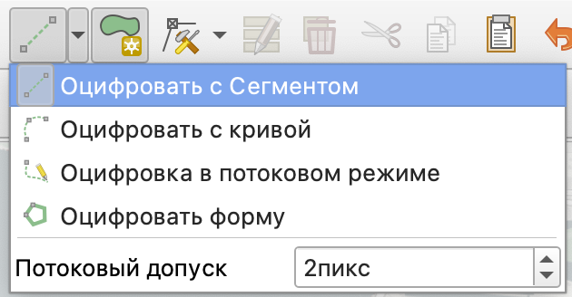{fig-align="center"}

-   оцифровать с кривой

```{=html}
<video width="800" height="600" controls>
  <source src="images/Запись экрана 2025-09-19 в 16.51.54.mp4" type="video/mp4">
</video>
```

-   оцифровка в потоковом режиме

```{=html}
<video width="800" height="600" controls>
  <source src="images/Запись экрана 2025-09-19 в 16.53.27.mp4" type="video/mp4">
</video>
```

-   оцифровать форму

```{=html}
<video width="800" height="600" controls>
  <source src="images/Запись экрана 2025-09-19 в 16.56.25.mp4" type="video/mp4">
</video>
```

::: callout-tip
По умолчанию у вас после создания каждого объекта будет всплывать окно заполнения атрибутов. Вы можете заполнять атрибуты сразу для каждого объекта или потом сразу для всех в атрибутивной таблице. Главное, не забывайте в этой форме нажимать OK, иначе объекты не будут созданы.

Если вы хотите отключить автоматическую форму, это можно сделать в настройках программы: *Настройки* $\longrightarrow$ *Параметры*.

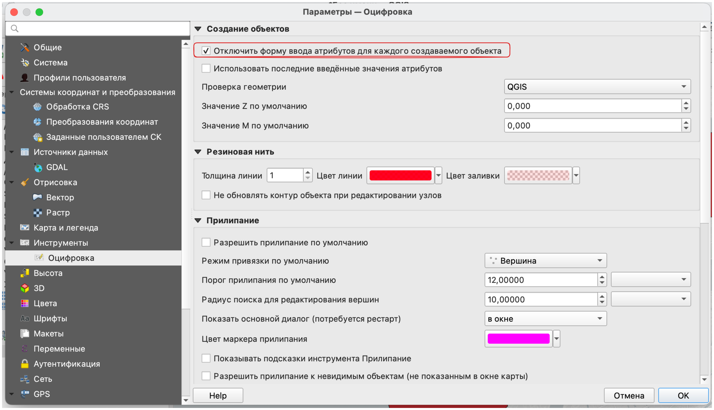
:::

В том случае, если вы хотите создавать объекты конкретной геометрической формы (квадраты, круги, эллипсы), вы можете включить *Панель инструментов оцифровки*.

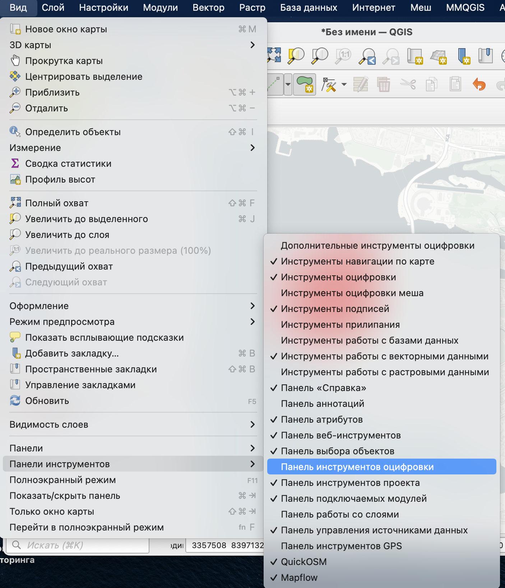{fig-align="center" width="773"}

Эта панель будет добавлена на панель инструментов и позволит вам создавать геометрические объекты определенной формы с различными параметрами:

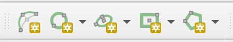{fig-align="center"}

-   *циклическая строковая последовательность по радиусу* (*Circular string by radius*) - отрисовка кривыми по двум точкам;

-   круг;

    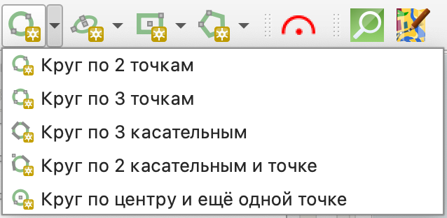

-   эллипс;

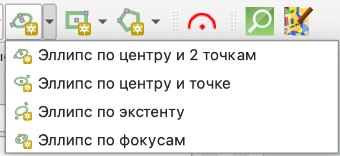{fig-align="center"}

-   прямоугольник;

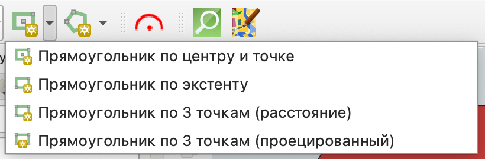{fig-align="center"}

-   создание правильного (выпуклого) многоугольника.

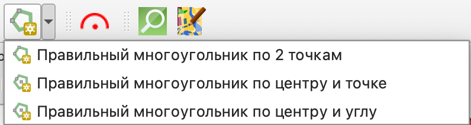{fig-align="center"}

Для переноса объектов и их редактирования можно воспользоваться панелью дополнительных инструментов оцифровки.

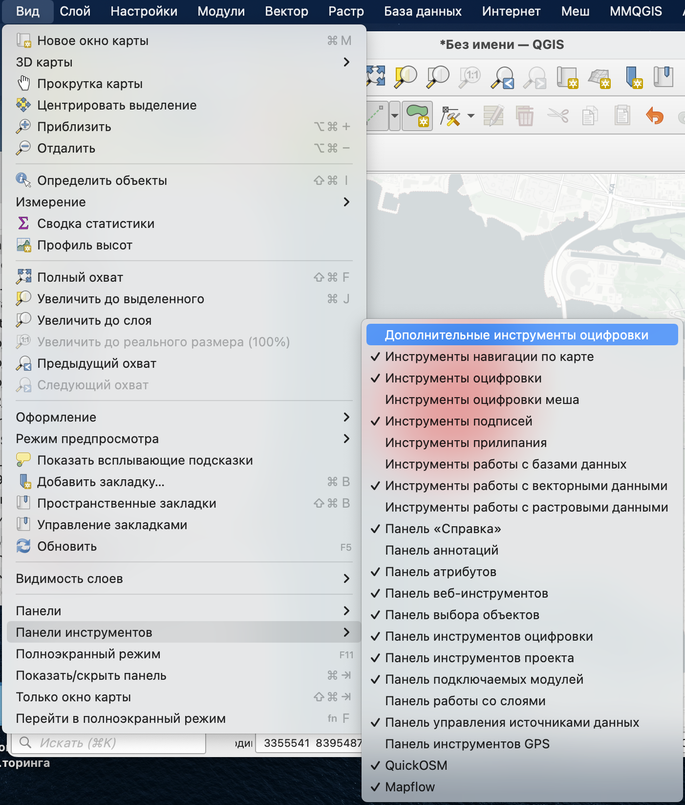{fig-align="center" width="767"}

Она будет добавлена на основную панель инструментов. С ее помощью вы можете переносить объекты, поворачивать, вырезать отверстия в полигонах, разрезать объекты и прочее.

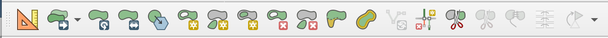{fig-align="center"}

Если вы хотите отрисовывать объекты по их геометрическим параметрам: углам между сотронами или сегментами линий, расстоянию, координатам поворотных точек, то вы можете воспользоваться еще одной панелью дополнительных инструментов оцифровки.

Ее можно включить или по клику на значок 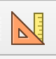{width="33" height="34"}, или из строки меню.

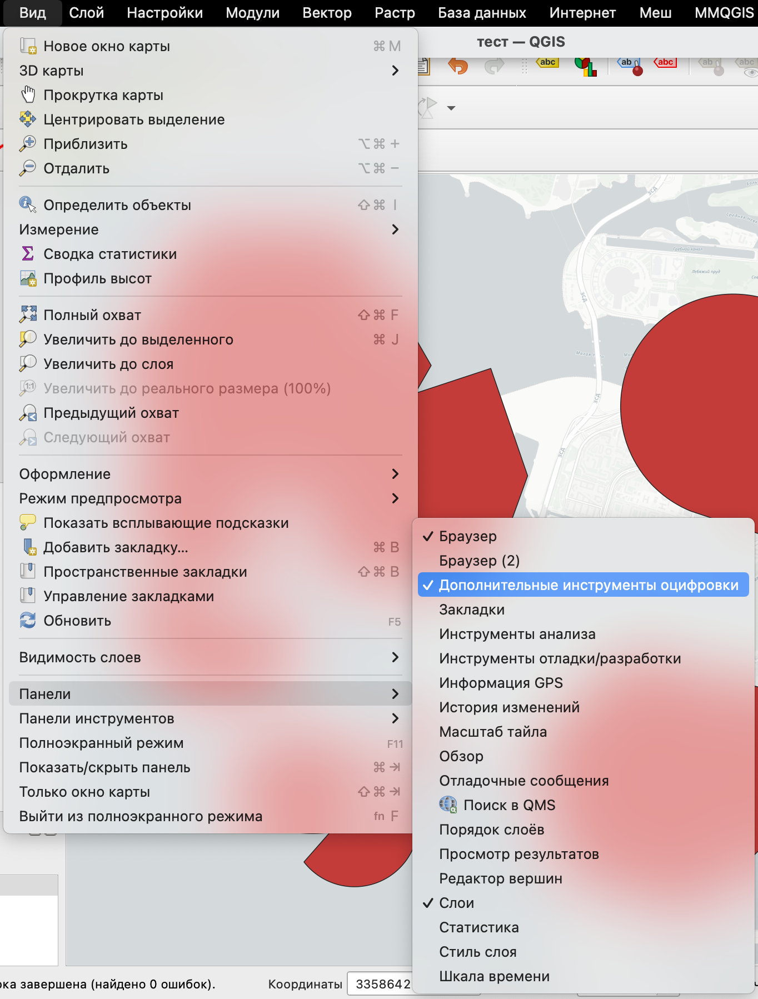{fig-align="center" width="683"}

::: callout-caution
Обратите внимание, что она открывается из пункта *Панели* элемента меню *Вид*.

Наличие в меню одновременно пункта *Панели* и \_Панели инструментов связано с особенностями перевода: в оригинале это *Panel* и *Toolbar* соответственно.
:::

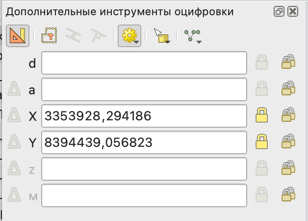{fig-align="center" width="558"}

```{=html}
<video width="800" height="600" controls>
  <source src="images/Запись экрана 2025-09-21 в 12.56.57.mp4" type="video/mp4">
</video>
```

```{=html}
<video width="800" height="600" controls>
  <source src="images/Запись экрана 2025-09-21 в 13.00.32.mp4" type="video/mp4">
</video>
```

## Привязка объектов

В QGIS существует привязка объектов друг к другу, похожа по своему принципу работы на объектную привязку в CAD системах.

Вы можете включить привязку объектов друг к другу по умолчанию в настройках программы.

{fig-align="center" width="1286"}

Но здесь вы можете настроить только прилипание к одному типу элементов. Для более контролируемой привязки объектов лучше воспользоваться *Инструментами прилипания*, которые можно добавить на панель инструментов из строки меню.

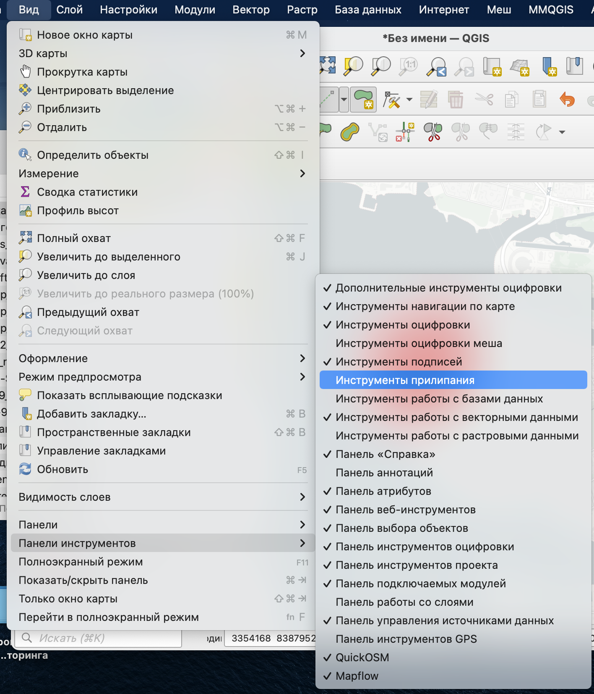{width="771"}

Эта панель активируется по клику на символ магнита.

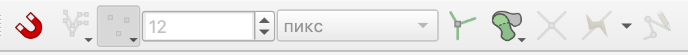{fig-align="center"}

Основные инструменты панели (слева направо):

-   разрешить прилипание;

-   выбор слоев, для которых будет доступно прилипание: все слои - прилипание будет осуществляться с учетом объектов всех слоев, которые есть в проекте (даже невидимых в данный момент), активный слой - прилипание будет осуществляться только для объектов текущего слоя.

-   тип объектов, к которым осуществляется прилипание (может быть выбрано сразу несколько вариантов):

    -   к вершинам - прилипание только к узловым точкам;

    -   к линиям - прилипание к любой точке линии;

    -   к поверхности - прилипание к любой точке внутри полигона;

    -   к центроиду - прилипание к геометрическому центру полигона;

    -   середина отрезка - прилипание только к середине линии;

    -   конечные точки линии - прилипание только к начальной или конечной точке линии.

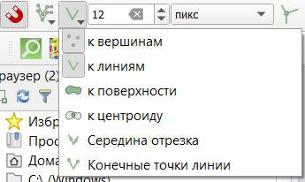{fig-align="center"}

-   порог прилипания - то есть, в какой области вокруг курсора будет искаться объект для прилипания;

-   топологическое редактирование позволяет сохранять общие границы между объектами. Если эта опция включена, то программа будет автоматически перестраивать общую границу для двух объектов (если таковая граница есть);

-   допустимы ли наложения между объектами;

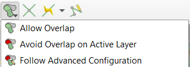{fig-align="center"}

-   разрешать прилипание к пересечениям - прилипание будет осуществляться к пересечениям двух объектов, даже если там нет вершины;

-   трассирование (tracing) - позволяет ускорить привязку к линейным объектам, при включении этой опции вам не нужно будет прощелкивать по всей линии, достаточно будет нескольких точек (если установить значение отступа offset, то можно построить линию, параллельную существующей);

-   самоприлипание - позволяет осуществлять привязку отрисовываемого объекта к самому себе.

```{=html}
<video width="800" height="600" controls>
  <source src="images/Запись экрана 2025-09-21 в 13.20.20.mp4" type="video/mp4">
</video>
```

В процессе привязки вы увидите, что форма вашего курсора меняется в зависимости от того, к какому типу объекта вы привязываетесь.

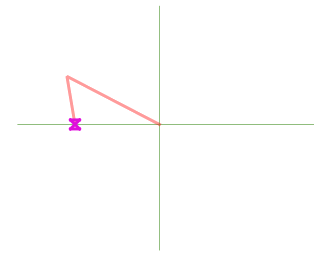{fig-align="center"}

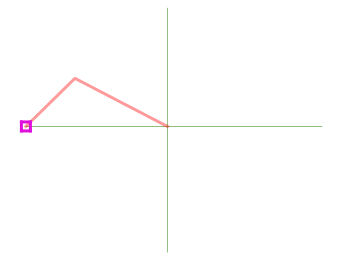{fig-align="center"}

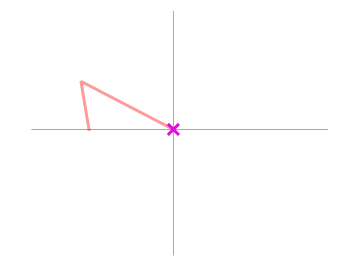{fig-align="center"}

## Редактирование формы объектов

Основной инструмент редактирования формы - *Инструмент редактирования вершин* 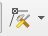{width="45" height="33"} предназначен для редактирования линий и полигонов.

Для того, чтобы его активировать необходимо, чтобы ваш слой был редактируемым и активен инструмент рисования.

Этот инструмент может работать как только в текущем активном слое, так и для всех слоев одновременно (что может быть удобно, если у вас несколько слоев для редактирования и вы не хотите постоянно переключаться между ними.

После активации инструмента у вас в правой части окна появится небольшая панель редактированимя вершин, в которой вам предлагается возможность просмотра каталога вершин объектов.

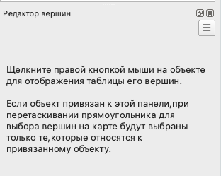{fig-align="center"}

В панели редактора отображаются координаты точек в системе координат слоя.

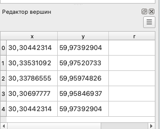{fig-align="center"}

При простом наведении на объект вы увидите, что его контур будет подсвечиваться и узлы отображаться более крупно.

```{=html}
<video width="800" height="600" controls>
  <source src="images/Запись экрана 2025-09-21 в 12.25.26.mp4" type="video/mp4">
</video>
```

## Редактирование структуры таблицы атрибутов

Атрибуты - это непространственные характеристики объектов, которые отображаются в табличном виде, где одна строка таблицы - это один объект, а каждый столбец - это характеристика объекта.

Открыть таблицу атрибутов можно из контекстного меню слоя.

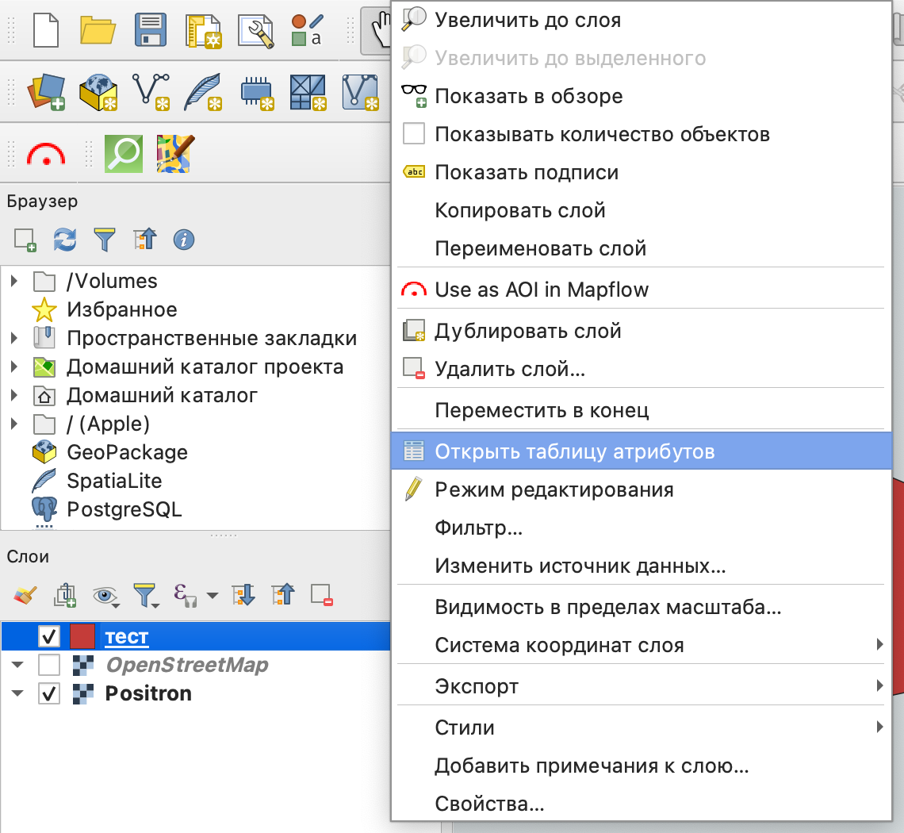{fig-align="center" width="869"}

Когда вы выделяете объект на карте, он выделяется в таблице атрибутов, и наоборот.

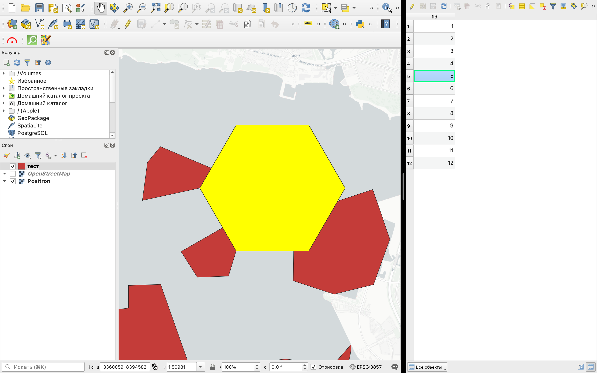{fig-align="center" width="1440"}

У таблицы атрибутов есть своя собственная панель инструментов.

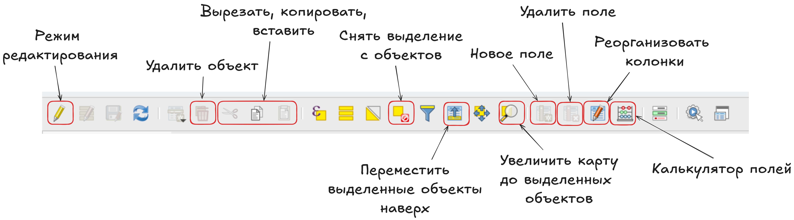

При добавлении нового поля необходимо указать его имя (оно должно быть уникальным в рамках таблицы атрибутов) и тип данных, которые будут содержаться в этом поле.

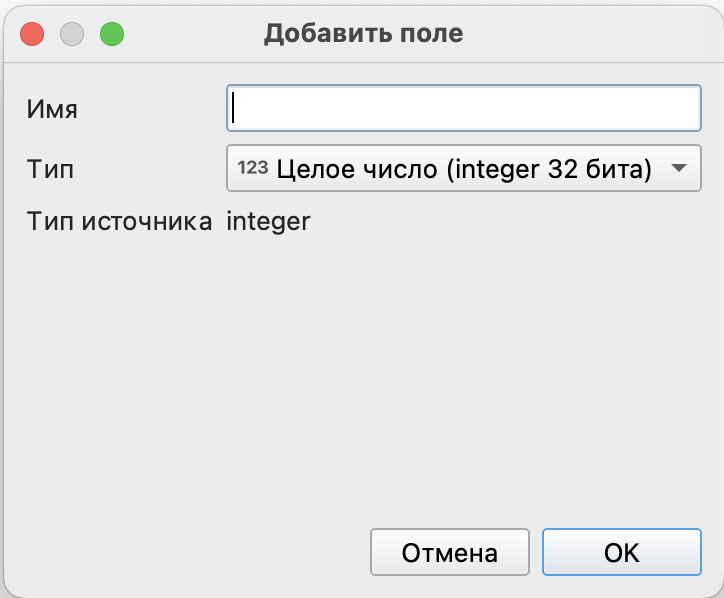{fig-align="center" width="605"}

При удалении полей, если вы хотите удалить несколько из них, вы можете выделить в списке их все, просто кликнув на названия.

Реорганизация полей значит изменение их порядка в таблице, для нее вы можете просто перетащить названия полей в списке, установив тот порядок, который хотите. В списке ваши поля будут перечислены сверху вниз, что соответствует их порядку в таблице слева-направо.

Калькулятор полей необходим для создания вычисляемых полей или обновления значений в уже существующих полях. Мы будем активно работать с калькулятором полей в более поздних разделах.

Обратите внимание, что при работе с форматом *geopackage*, у вас по умолчанию будет добавлено поле *fid*, которое заполняется автоматически.

## Автоматическое заполнение атрибутов

Если вам нужно заполнять таблицу атрибутов известными повторяющимися данными, то вы можете просто указать значения по умолчанию для нужных атрибутов. Для этого вам нужно открыть свойства слоя (правый клик на название слоя и выбор пункта *Свойства* контекстного меню или двойнов клик на название слоя) и выбрать в левой части окна пункт *Формы полей*.

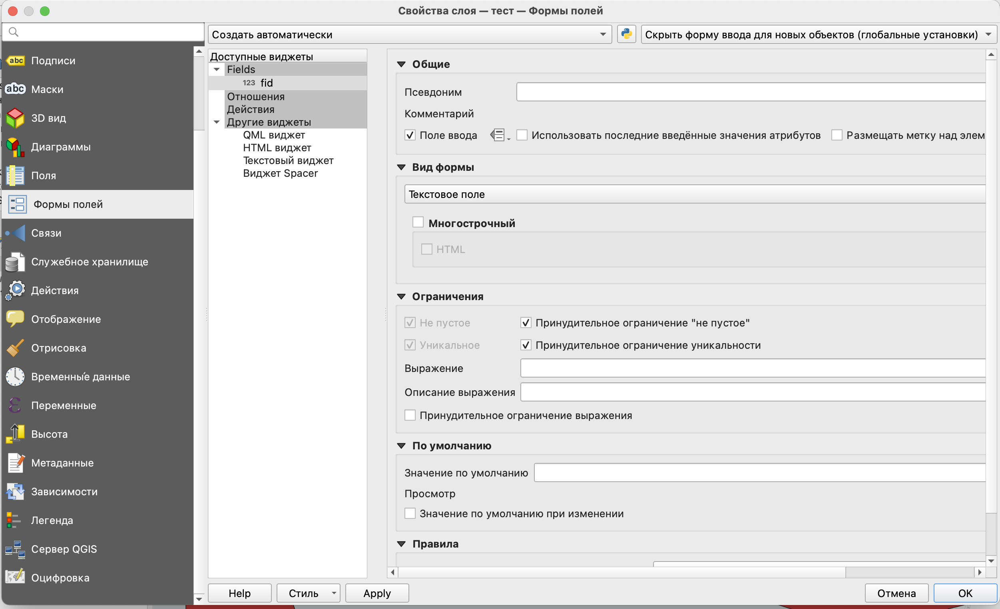

После этого вы увидите перечень своих полей под заголовком *Fields*.

Кликнув на конкретное поле в перечне вы можете указать его значение по умолчанию, то есть для каждого нового объекта (новой строки в таблице атрибутов) у вас будет прописано это значение.

Кроме того, вы можете сделать это поле вычисляемым на основе выражения, то есть будет указываться не просто какое-то значение, а оно будет рассчитываться и вноситься в этот атрибут.

# Проект в QGIS

Как упоминалось ранее, **проект** - это ваш сеанс работы, в котором хранится информация о всех открытых в данных момент слоях, их стилях, макетах и геомоделях.

::: callout-important
По умолчанию проект сохраняет **относительные пути к файлам**. Поэтому, если вы будете перемещать файлы между папками, то у вас могут потеряться пути к файлам.

Тип пути для сохранения для всех будущих проектов можно изменить в настройках проекта, но это требует перезапуска программы и пересохранения проекта.

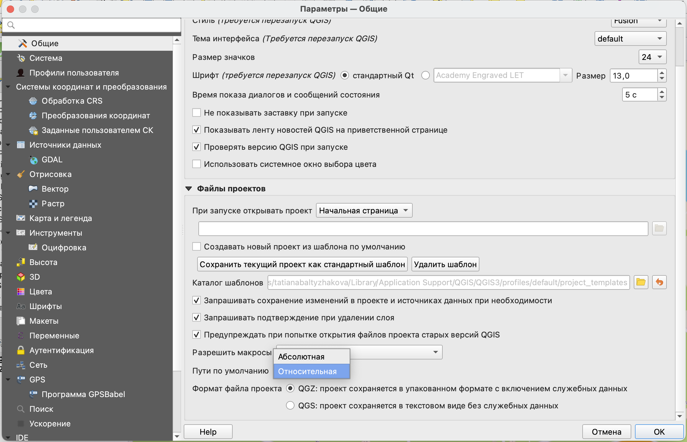{fig-align="center" width="1397"}
:::

::: callout-tip
Если у вас не открывается какой-то слой, из-за потерянного пути к файлу, то вы можете указать новый путь к нему. Это можно сделать функцией *Изменить источник данных* из контекстного меню слоя.

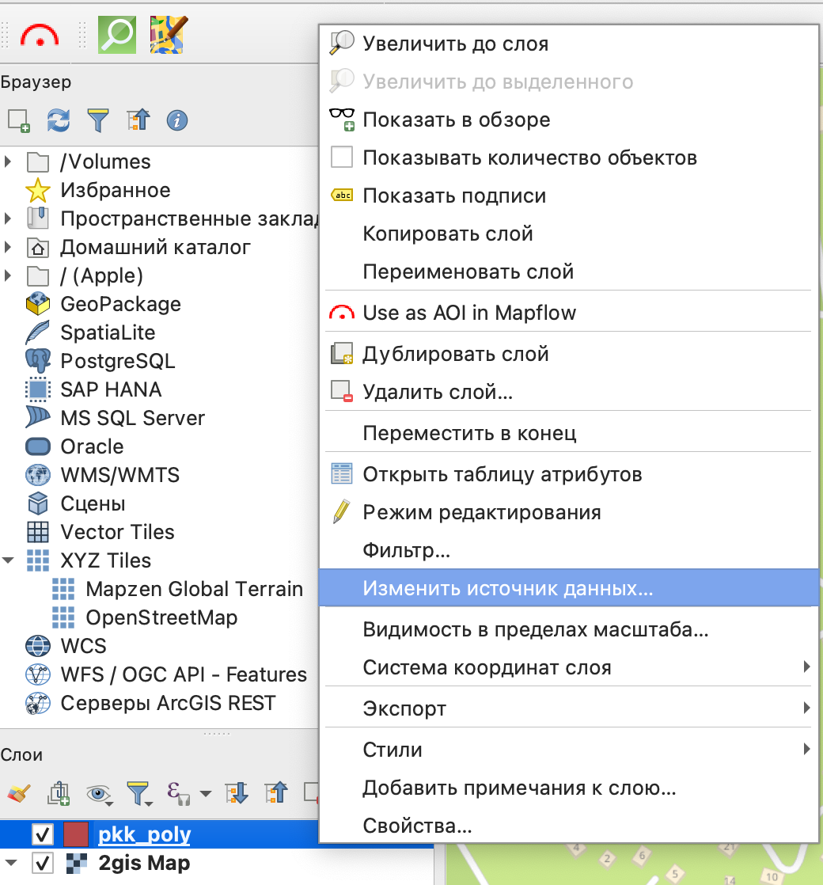{fig-align="center" width="744"}
:::

Что ваш проект будет хранить в себе:

-   перечень открытых слоев из файлов;

-   перечень открытых удаленных источников;

-   настройки стилей слоев;

-   макеты - оформленные карты, подготовленные к публикации;

-   геомодели - алгоритм действий для вашего рабочего процесса.

У проекта есть своя система координат, которая может отличаться от системы координат слоя/слоев. Эта система координат указана в правом нижнем углу интерфейса программы.

При нажатии на эту кнопку вы увидите, что открылись не просто настройки системы координат проекта, но и общие настройки открытого в данный момент проекта.

::: callout-important
Если вы хотите изменить какие-то свойства текущего проекта, то вы можете воспользоваться одним из способов: кнопка в правом нижнем углу интерфейса и строка меню *Проект* $\longrightarrow$ *Свойства проекта.*

Если вы хотите изменить какие-то настройки проектов по умолчанию для всех будущих проектов, то вам нужно открыть свойства программы из строки меню: *Настройки* $\longrightarrow$ *Параметры.*
:::

::: callout-tip
Если вы сомневаетесь в том, где сохранены все ваши файлы, сопутствующие проекту, или вы знаете, что они разбросаны по разным местам, можно воспользоваться модулем *Project packager*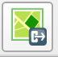{width="37"}.

С его помощью вы можете выбрать каталог для сохранения своего проекта, куда будут скопированы все необходимые файлы, или вы можете упаковать весь свой проект в файл *GeoPackage*.

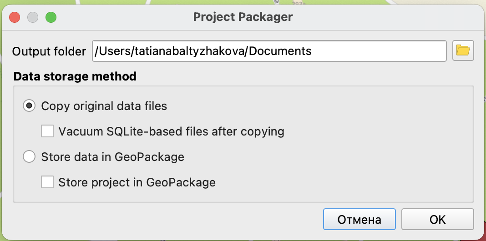{fig-align="center" width="800"}
:::

# Загрузка данных OSM

**OpenStreetMap (OSM)** — проект, который создаёт и предоставляет свободные географические данные, дает возможность создавать карты любому пользователю. Каждый желающий может поучаствовать в проекте (загружать свои треки на сервер, дорисовывать общедоступную карту по спутниковым снимкам Bing, MapBox, DigitalGlobe (весь мир), IRS (запад России), SPOT4 (восток России) и SPOT (Белоруссия) от Космоснимки.ру, ASTER (Россия), OrbView-3 и другими) и использовать эти карты совершенно свободно, и бесплатно в отличие от многих других карт, даже бесплатных, свободное использование которых ограничено.

Построен проект по принципу Wikipedia, то есть любой пользователь может внести и отредактировать данные.

Карты этого проекта очень широко используются как в некоммерческих целях, например, для исследовательских проектов, так и для коммерческих проектов, например, создания навигационных приложений.

Вот очень любопытный [прецедент](http://shtosm.ru/all/vserossiyskaya-perepis-pod-ugrozoy/) использования OSM в нашей стране.

## Структура данных OSM

Все объекты в OSM делятся на три типа элементов:

-   ***точки***, которые представляют точечные объекты, у каждого из них есть как минимум идентификатор и пара координат;

-   ***линии*** - это упорядоченный набор точек (не менее двух и не более 2000), которые формируют ломаную линию;

-   ***отношения*** - составной элемент, показывающий связь между двумя и более простыми элементами (точками, линиями, отношениями).

::: callout-important
Обратите внимание, что здесь нет типа элемента "полигон". Полигонами здесь будут являться замкнутые ломаные.
:::

Все объекты имеют идентификатор (он есть всегда), а также так называемые **теги**, которые описывают географические характеристики объекта.

Именно с помощью тегов, как правило, и осуществляется поиск объектов в базе.

Все значения тегов можно посмотреть на странице [Объекты карты](https://wiki.openstreetmap.org/wiki/RU:%D0%9E%D0%B1%D1%8A%D0%B5%D0%BA%D1%82%D1%8B_%D0%BA%D0%B0%D1%80%D1%82%D1%8B), если вам необходимы дополнительные пояснения, то можно обратиться к странице [Как обозначить](https://wiki.openstreetmap.org/wiki/RU:%D0%9A%D0%B0%D0%BA_%D0%BE%D0%B1%D0%BE%D0%B7%D0%BD%D0%B0%D1%87%D0%B8%D1%82%D1%8C).

На русском перечень ключей и значений с пояснениями можно найти в [таблице](https://docs.google.com/spreadsheets/d/1YgTDaw160aZ60DPUxuJrfYGyGykKJQDZE3c0W2O-OSY/edit?usp=sharing), составленной автором ТГ канала [UrbanStudent](https://t.me/urbanstudent).

Если вам нужно найти какие-то специфичные объекты, то рекомендую внимательно посмотреть страницу вики и пройти по ссылке на страницу интересующего вас тега или его значения, там часто бывают пояснения, как обозначаются те или иные особенности и характеристики объектов.

## Сервис overpass-turbo

Один из самых простых способов скачивания пространственных данных с OSM - это использование сервиса <http://overpass-turbo.eu/>.

Подробная информация о сервисе [[https://wiki.openstreetmap.org/wiki/Overpass_turbo]{.underline}](https://wiki.openstreetmap.org/wiki/Overpass_turbo)


Для создания запросов используется собственный язык запросов **Overpass QL** (Overpass Query Language).

Есть несколько различных типов *формулировок* Overpass QL . Они сгруппированы в:

-   *Параметры,* которые являются необязательными глобальными переменными, устанавливаются в первом операторе запроса. Примерами *настроек* являются тайм-аут сервера для сервера Overpass API и формат вывода запроса Overpass QL.

-   *Операторы блока* : *операторы* блока группируют операторы Overpass QL вместе.

-   *Автономные запросы*: это самостоятельные полные утверждения. Они могут выполнять такие функции, как запрос к серверу Overpass API для создания набора; манипулирование содержимым существующего набора; или отправка конечных результатов запроса в место вывода. Автономные запросы сами по себе состоят из более мелких языковых компонентов Overpass QL, таких как оценщики, фильтры и операторы.

На самом деле, чтобы составить запрос вам не обязательно знать все тонкости языка запросов. Вот основные моменты, которые необходимы для запроса:

-   то, как объекты обозначаются в OSM - ключ и его значение;

-   тип объектов (не обязательно, а только, если вы хотите выгружать конкретный тип объектов - точки, линии или полигоны);

-   охват территории поиска - bounding box (по умолчанию задается по видимой части карты в правой половине окна, но можно задать непосредственно в запросе или выбрать вручную на карте).

Подробная информация о том, какие объекты как [обозначаются в OpenStreetMap](https://wiki.openstreetmap.org/wiki/RU:%D0%9E%D0%B1%D1%8A%D0%B5%D0%BA%D1%82%D1%8B_%D0%BA%D0%B0%D1%80%D1%82%D1%8B). На этой странице можно искать нужный вам тип объектов, чтобы составить запрос.

В левой части окна будет отображаться выполняемый запрос, а в правой результаты этого запроса. По умолчанию поиск осуществляется в той области, которая отображается в правой части окна (это можно скорректировать более сложными запросами, см. справку о сервисе).

Для составления запросов используется помощник. Обратите внимание, что в нем сразу можно использовать логические операторы.

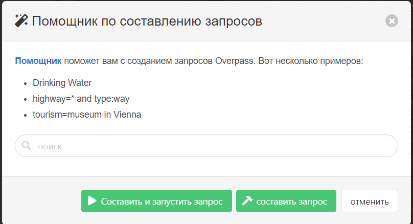{fig-align="center"}

> Для примера можно найти и загрузить данные по многоквартирным жилым домам (*building=apartments*) и основным магистральным улицам (*highway=primary or highway=secondary or highway=tertiary,* то есть центральные магистрали, основные магистрали районов и основные микрорайонные или межмикрорайонные транзитные улицы) в Санкт-Петербурге.

Первый запрос по поиску жилых домов выглядит примерно так. Обратите внимание, что я убрала пункт ***node***, чтобы у нас не производился поиск точечных объектов.

{fig-align="center"}

Результат запроса будет показан на карте в правой части окна.

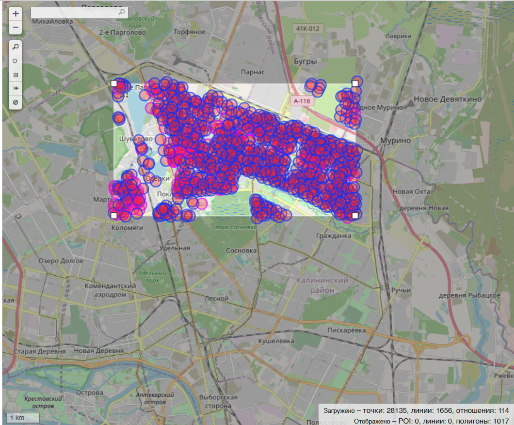

По умолчанию поиск объектов производится внутри видимой области карты в правой части окна, но с помощью кнопок управления, расположенных в этой части окна вы можете выбрать, например, прямоугольную область поиска.

В нижнем правом углу окна видно, сколько объектов какого типа было найдено, а сколько отображено.

Эспортируем результаты себе на компьютер для дальнейшей работы с ними в QGIS. Для этого нужно нажать кнопку **Экспорт**, после чего появится диалоговое окно экспорта.

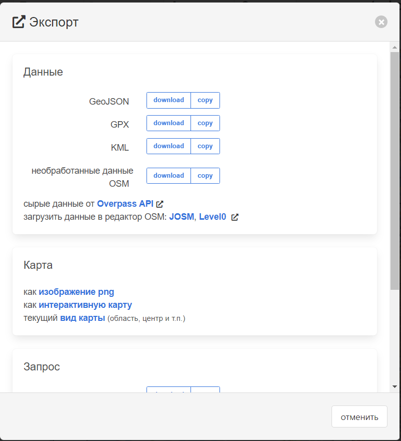{fig-align="center" width="637"}

Данные можно сохранить себе в формате *geojson*, кроме этого формата данные также можно скачать в GPX, KML, в виде сырых данных, а также в виде данных для редактирования OSM.

::: callout-tip
При желании более подробно ознакомиться с логикой построения запросов и языком запросов, вы можете воспользоваться интерактивным учебником <https://osmlab.github.io/learnoverpass//en/>

Или взять уже готовые запросы из коллекции запросов <https://osm-queries.ldodds.com/>
:::

## Модуль QuickOSM

Кроме непосредственного использования сервиса можно скачивать данные OSM напрямую из QGIS с помощью модуля **QuickOSM**.

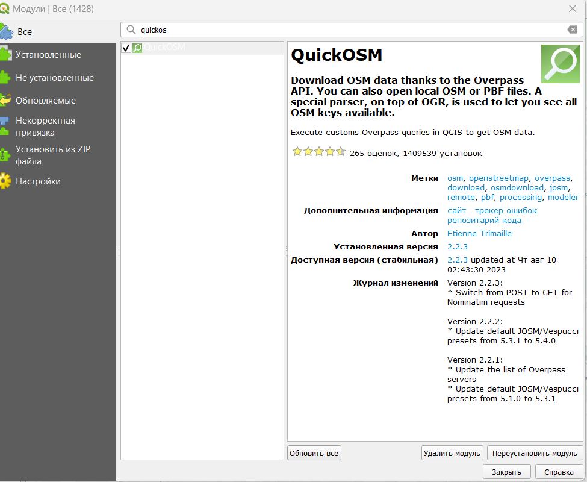{fig-align="center"}

После установки модуля на панели инструментов появятся два значка , левый из которых запускает окно поиска и загрузки данных из OSM, а правый позволяет удаленно подключаться к редактированию OSM через редактор [JOSM](https://josm.ru/).

На вкладке **Map preset** вы увидите существующие по умолчанию в модуле пресеты, а также свои сохраненные в виде пресетов запросы.

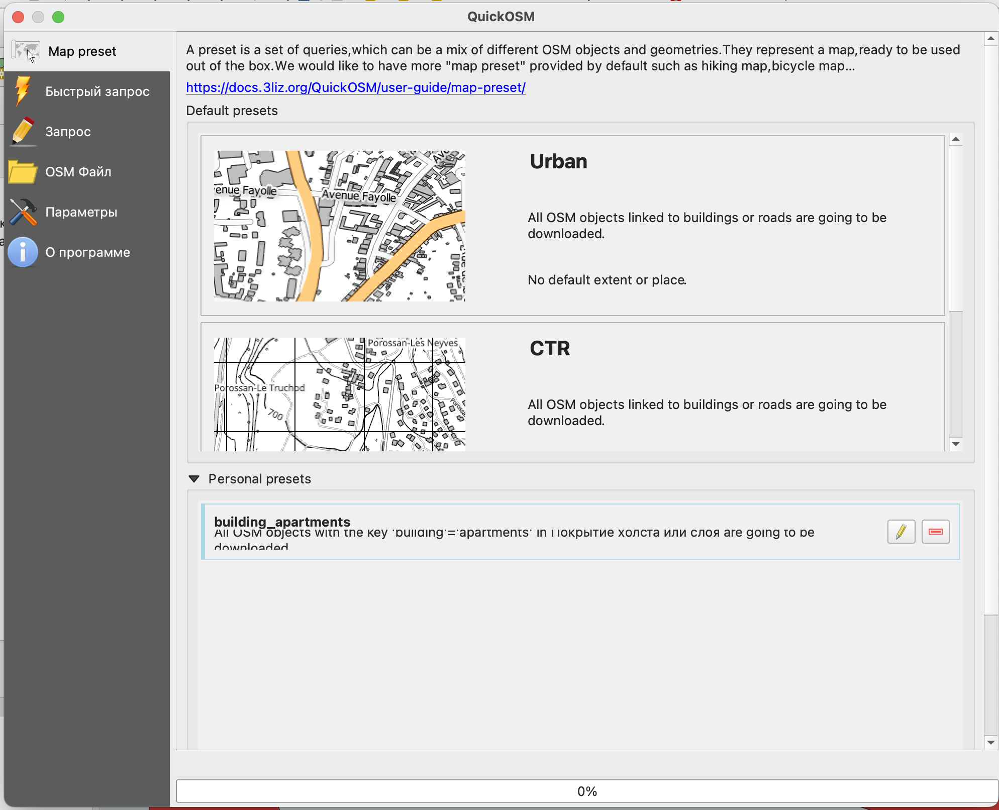{fig-align="center" width="1110"}

На вкладке **Быстрый запрос** вы можете составить свой запрос на поиск объектов.

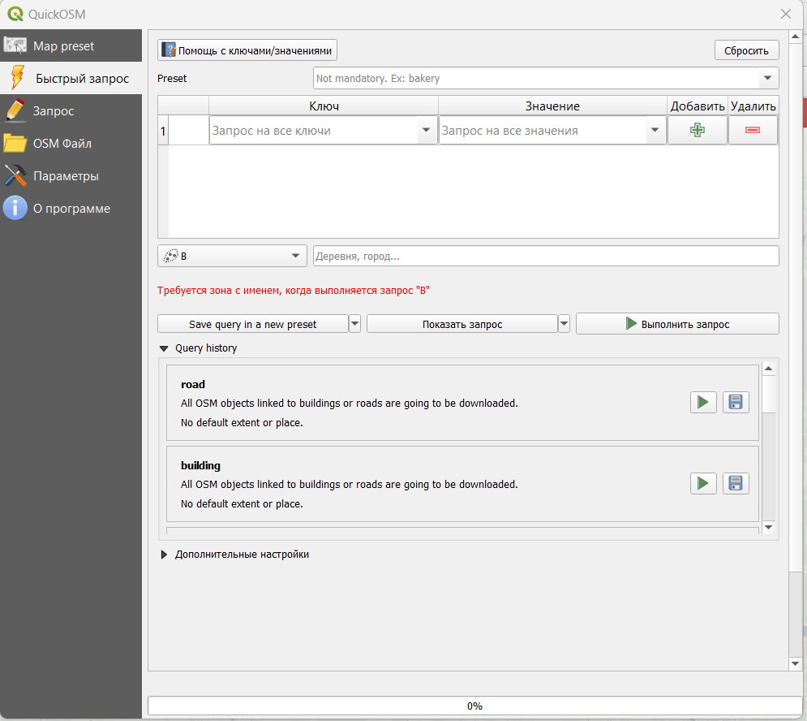{fig-align="center"}

Кнопка **Помощью с ключами/значениями** открывает страницу с документацией модуля <https://docs.3liz.org/QuickOSM/>

На второй строке находятся строка выбора пресетов (**Preset**) - готовый запросов по поиску объектов, поэтому если вы не очень уверены в том, как какие-либо объекты обозначаются, но знаете, какие вам нужны, можно попробовать найти уже готовый запрос здесь.

Сразу под этой строкой находится таблица, где вы можете выбирать конкретные ключи и их значения.

::: callout-important
Запрос может включать в себя сразу несколько пар ключ/значение, но в этом случае части запроса должны быть связаны одним из логических операторов ***AND*** или ***OR***.

Главное отличие в применении этих операторов состоит в том, что при выборе ***AND*** поиск объектов будет осуществляться с учетом того, что все части запроса должны *выполняться одновременно*.

При использовании оператора ***OR*** будет производится поиск объектов, *удовлетворяющих хотя бы одному условию из заданных*.
:::

{fig-align="center"}

-   **В** - поиск в заданном населенном пункте;

-   **Вокруг** - поиск в заданном радиусе вокруг населенного пункта;

-   **Покрывать холст** - поиск в пределах видимой в основном окне программы части карты;

-   **Покрывать слой** - поиск в пределах охвата конкретного слоя (необходимо выбрать нужный слой);

-   **Не пространственные** - не заданная конкретная область, поэтому поиск будет производиться во всех данных OSM вне зависимости от местоположения.

Свой запрос вы можете сохранить в виде пресета (**Save query in a new preset**), просмотреть его (**Показать запрос**) и **Выполнить запрос**.

При нажатии на кнопку **Показать запрос** у вас откроется вкладка **Запрос**, где текст вашего запроса будет показан на языке запросов Overpass.

{fig-align="center"}

В пункте **Query history** на вкладке **Быстрый запрос** у вас будут отображаться уже сделанные вами запросы.

В дополнительных настройках быстрого запроса можно указать:

-   тип объекта для поиска;

-   время ожидания при выполнении запроса;

-   путь к папке для сохранения результатов запроса и формат сохранения данных, а также префикс файла для более простой идентификации.

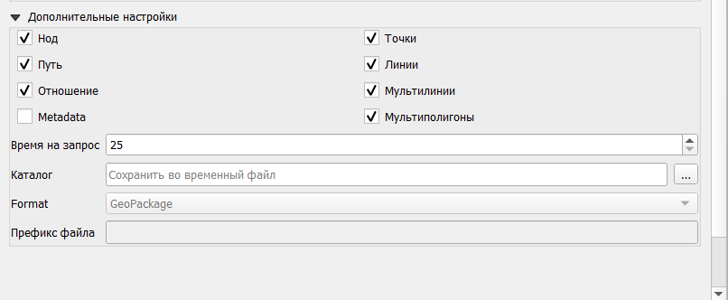{fig-align="center"}

Вкладка **OSM файл** позволяет загружать сырые данные из OSM для их редактирования.

В **Параметрах** вы можете выбрать конкретный сервер Overpass для соединения и сервер Nominatim[^3].

[^3]: В данном случае этот сервис нужен для осуществления геокодирования, то есть поиска положения населенного пункта по его названию

{fig-align="center"}
